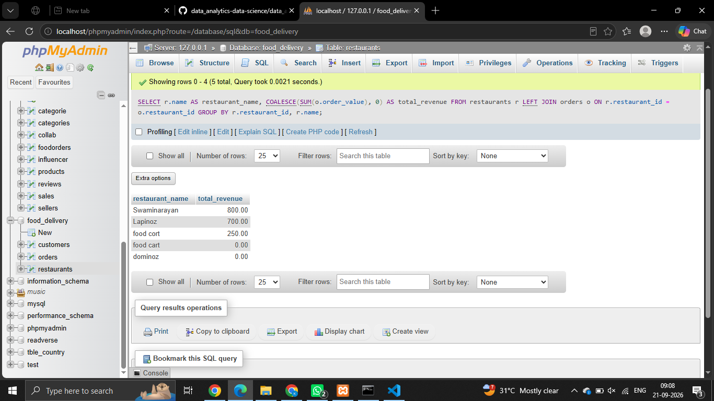
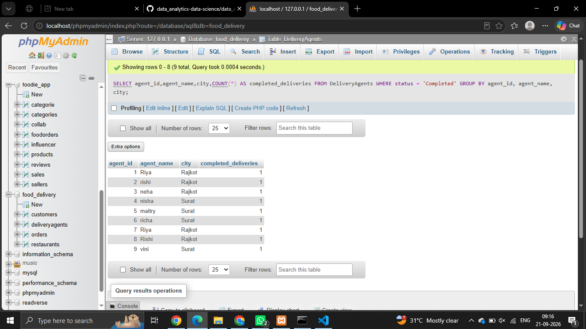
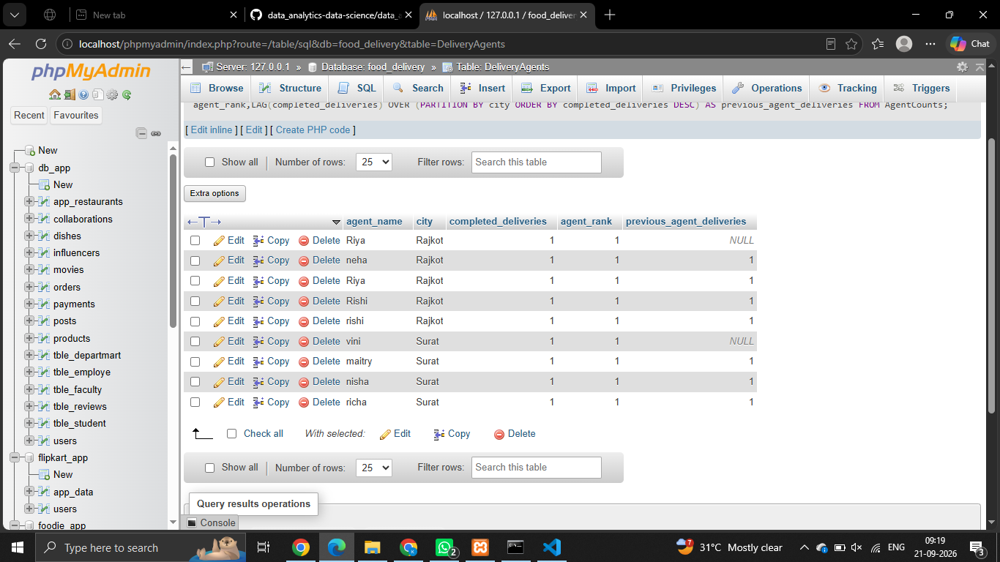
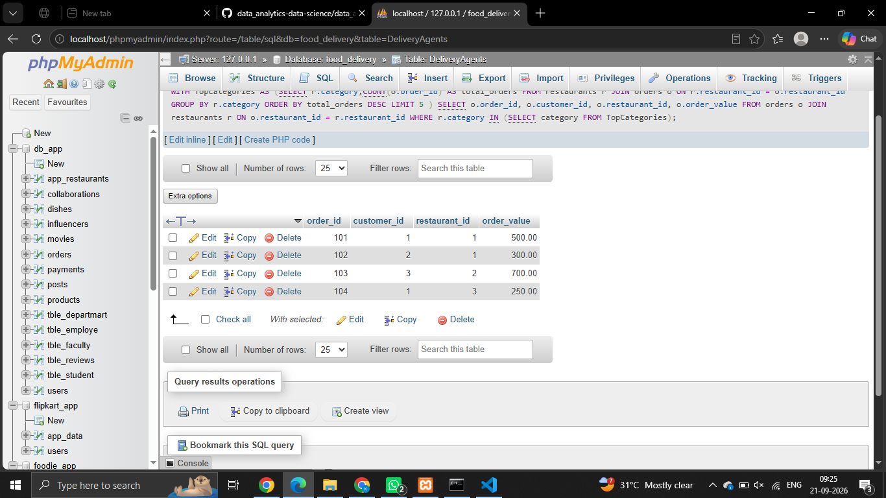
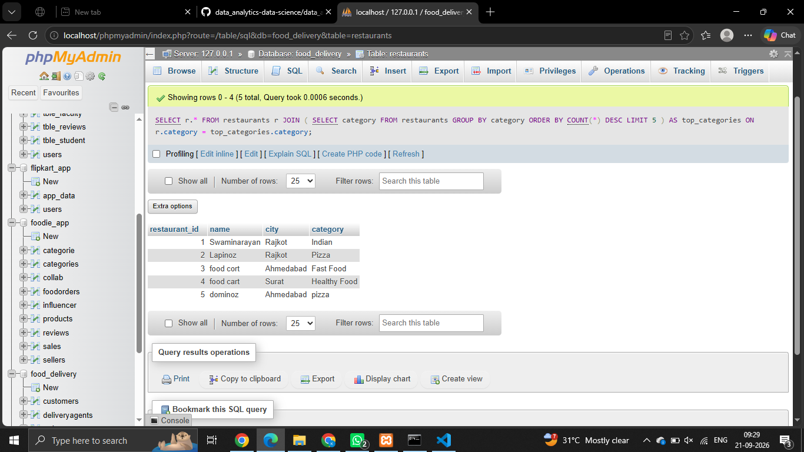

## Assessments 

## Senario - 4 
SCENARIO: You are managing a food delivery database with three tables: orders (order_id, customer_id, restaurant_id, order_value), restaurants (restaurant_id, name, city, category), and customers (customer_id, name, area). A business team asks for a report showing every restaurant's name and total revenue, including restaurants that have not yet received any orders.

# Question: 
Explain which SQL JOIN type must be used to include restaurants with zero orders and describe what would happen if an INNER JOIN were used instead. Justify your choice of join type in terms of how it handles unmatched rows between the two tables

```
CREATE DATABASE food_delivery;
USE food_delivery;

CREATE TABLE restaurants (
    restaurant_id INT PRIMARY KEY,
    name VARCHAR(100),
    city VARCHAR(50),
    category VARCHAR(50)
);

CREATE TABLE customers (
    customer_id INT PRIMARY KEY,
    name VARCHAR(100),
    area VARCHAR(100)
);

CREATE TABLE orders (
    order_id INT PRIMARY KEY,
    customer_id INT,
    restaurant_id INT,
    order_value DECIMAL(10,2),
    FOREIGN KEY (customer_id) REFERENCES customers(customer_id),
    FOREIGN KEY (restaurant_id) REFERENCES restaurants(restaurant_id)
);


SELECT
    r.name AS restaurant_name,
    COALESCE(SUM(o.order_value), 0) AS total_revenue
FROM restaurants r
LEFT JOIN orders o
    ON r.restaurant_id = o.restaurant_id
GROUP BY r.restaurant_id, r.name;
```


- Inner Join
```
SELECT
    r.name AS restaurant_name,
    SUM(o.order_value) AS total_revenue
FROM restaurants r
INNER JOIN orders o
    ON r.restaurant_id = o.restaurant_id
GROUP BY r.restaurant_id, r.name;
```


## Senario - 5
 SCENARIO: You are working on a food delivery analytics dashboard. Management wants to rank all delivery agents within each city by their number of completed deliveries for the current month, and also display how each agent's count compares to the agent ranked directly above them in that city.

 # Question: 
 Identify the two SQL window functions you would use — one for ranking and one for retrieving the previous row's value — and explain why using window functions with PARTITION BY produces more accurate and maintainable results for this requirement than a GROUP BY with a self-join or correlated subquery approach.
 
 ```
 CREATE TABLE DeliveryAgents (
    agent_id INT PRIMARY KEY,
    agent_name VARCHAR(100),
    city VARCHAR(50),
    delivery_date DATE,
    status VARCHAR(20)
);
```
```
SELECT agent_id,agent_name,city,COUNT(*) AS completed_deliveries FROM DeliveryAgents WHERE status = 'Completed' GROUP BY agent_id, agent_name, city;

```
 

 ```
 WITH AgentCounts AS (
    SELECT
        agent_id,
        agent_name,
        city,
        COUNT(*) AS completed_deliveries
    FROM DeliveryAgents
    WHERE status = 'Completed'
    GROUP BY agent_id, agent_name, city
)
SELECT agent_name,city,completed_deliveries,RANK() OVER (PARTITION BY city ORDER BY completed_deliveries DESC) AS agent_rank,LAG(completed_deliveries) OVER (PARTITION BY city ORDER BY completed_deliveries DESC) AS previous_agent_deliveries FROM AgentCounts;
 ```
 

 
## Senario - 5
SCENARIO: You are optimising a SQL report for a food delivery operations team. The report first identifies the top 5 restaurant categories by total order count, and then retrieves the full order details only for restaurants belonging to those top categories. A colleague has written this as a deeply nested subquery inside the WHERE clause.

# Question : 
Compare using a CTE (WITH clause) versus a nested subquery for this two-step requirement. Evaluate the trade-offs in terms of readability, ability to reuse the intermediate result, and debuggability. In what specific situation would you prefer the nested subquery over a CTE?

```
WITH TopCategories AS (SELECT r.category,COUNT(o.order_id) AS total_orders FROM restaurants r JOIN orders o ON r.restaurant_id = o.restaurant_id GROUP BY r.category ORDER BY total_orders DESC LIMIT 5
)
SELECT
    o.order_id,
    o.customer_id,
    o.restaurant_id,
    o.order_value
FROM orders o
JOIN restaurants r ON o.restaurant_id = r.restaurant_id
WHERE r.category IN (SELECT category FROM TopCategories);

```


```
```
SELECT r.*
FROM restaurants r
JOIN (
    SELECT category
    FROM restaurants
    GROUP BY category
    ORDER BY COUNT(*) DESC
    LIMIT 5
) AS top_categories
ON r.category = top_categories.category;
```
