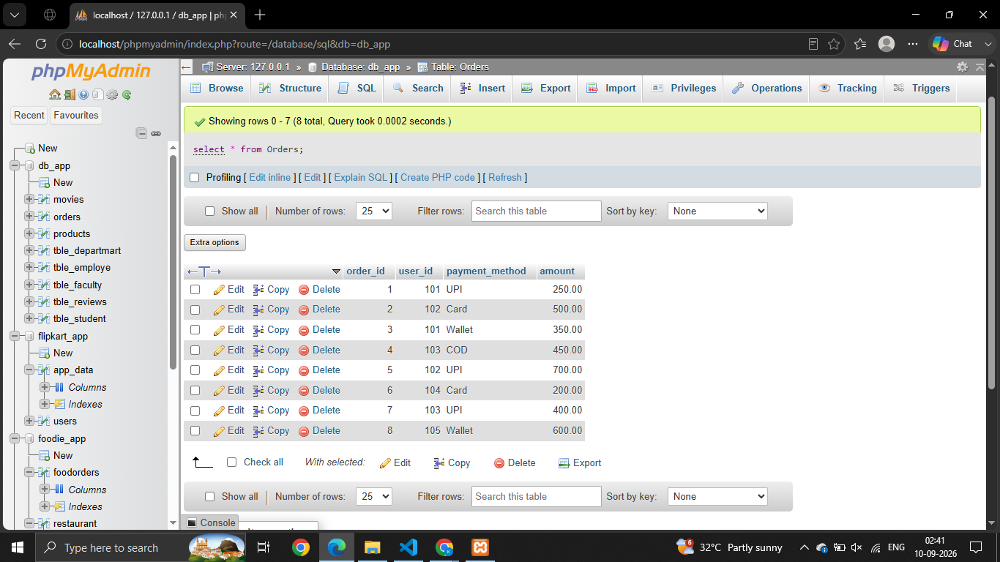
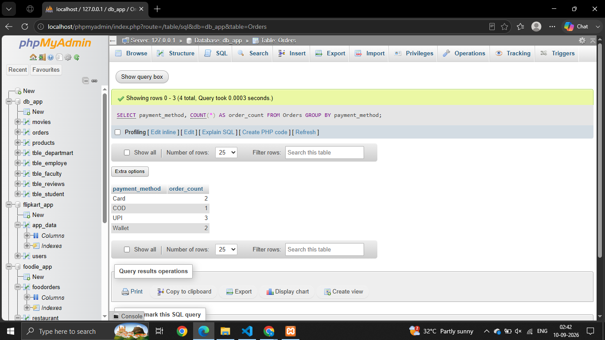
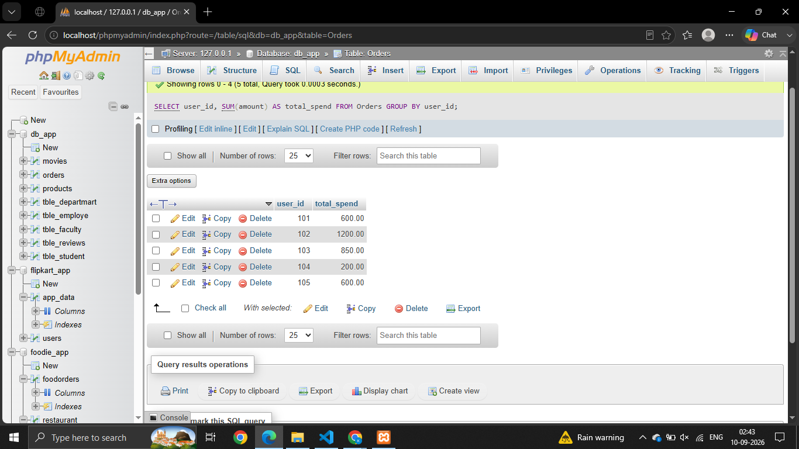
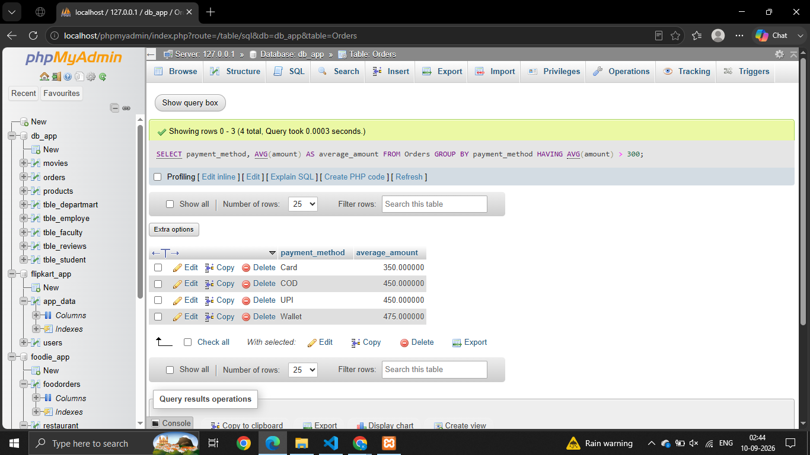
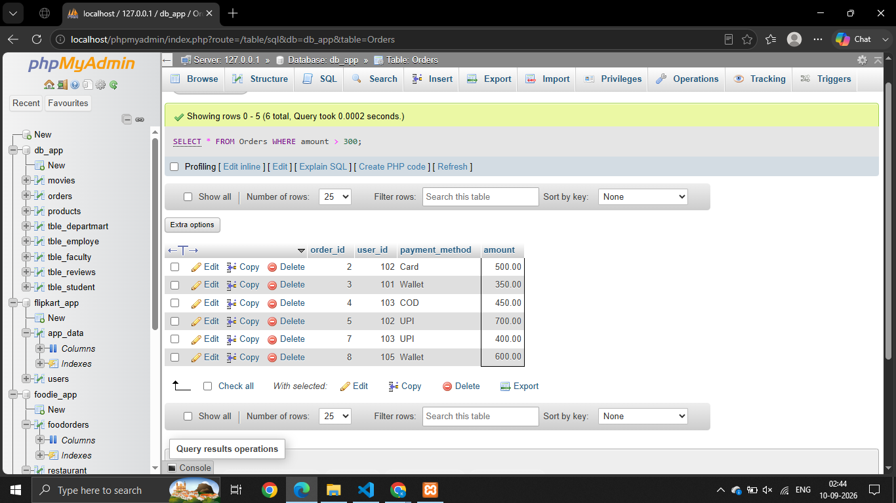

# Session -8 

# Que - 1 
Create a table called Orders with columns: order_id, user_id, payment_method, and amount. Insert at least 8 sample records representing different users and payment methods (like UPI, Card, Wallet, COD).
```
select * from Orders

```


# Que - 2
Write an SQL query to count how many orders were placed using each payment_method in the Orders table, similar to how Zomato shows payment breakdown in analytics.
```
SELECT payment_method, COUNT(*) AS order_count FROM Orders GROUP BY payment_method;

```


# Que - 3
Write an SQL query to find the total amount spent by each user_id in the Orders table. Display user_id and their total spend.
```
SELECT user_id, SUM(amount) AS total_spend FROM Orders GROUP BY user_id;

```


# Que - 4 
Write an SQL query to show only those payment methods where the average order amount is greater than 300, using GROUP BY and HAVING.
```
SELECT payment_method, AVG(amount) AS average_amount FROM Orders GROUP BY payment_method HAVING AVG(amount) > 300;

```


# Que - 5
Explain the difference between WHERE and HAVING by giving one example query for each, using the Orders table. Your examples should show a scenario where WHERE and HAVING filter different things.
```
SELECT * FROM Orders WHERE amount > 300;

```
