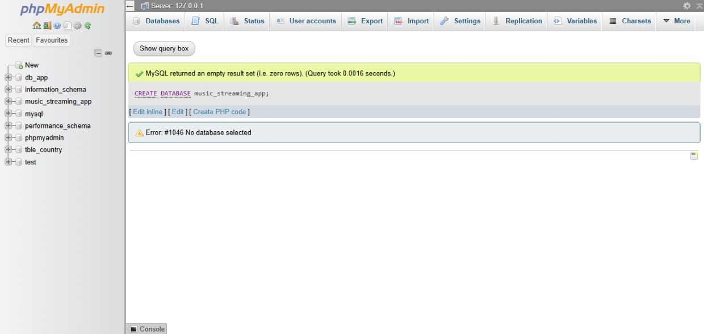
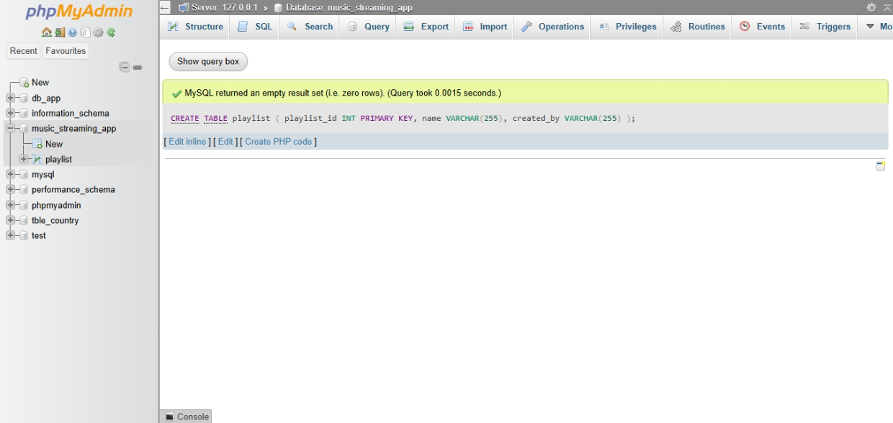
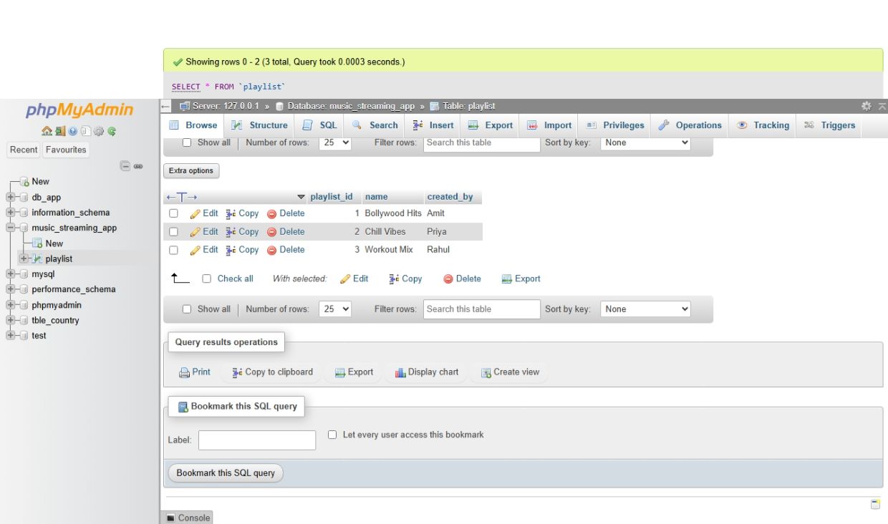
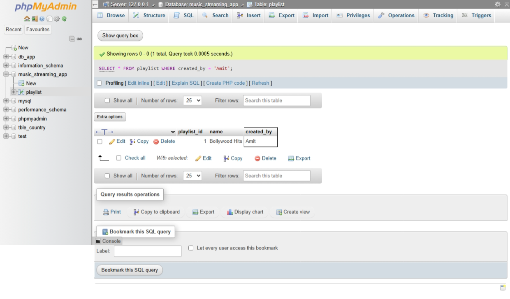

## SESSION-1

1. Install MySQL or PostgreSQL on your system and create a new database named 'music_streaming_app' using the command line or GUI tool of your choice



2. Inside the 'music_streaming_app' database, create a table called 'playlists' with columns: playlist_id (integer, primary key), name (varchar), and created_by (varchar).

```
CREATE TABLE playlists (
    playlist_id INT PRIMARY KEY,
    name VARCHAR(255),
    created_by VARCHAR(255)
);
```


3. Insert three sample rows into the 'playlists' table representing playlists like 'Bollywood Hits', 'Chill Vibes', and 'Workout Mix', each created by a different user.

```
INSERT INTO playlists (playlist_id, name, created_by)
VALUES
    (1, 'Bollywood Hits', 'Amit'),
    (2, 'Chill Vibes', 'Priya'),
    (3, 'Workout Mix', 'Rahul');

```




4. Write an SQL SELECT query to display all playlists created by the user 'Amit' from the 'playlists' table.


```
SELECT * FROM playlist WHERE created_by = 'Amit';

```



5. Open ChatGPT or Copilot and ask it to explain the difference between a table, a row, and a column in SQL using an example from a food delivery app like Zomato. Paste the explanation you receive into your assignment.

# Difference Between Table, Row, and Column in SQL

In SQL, a **table** is used to store related data in an organized format. A table consists of **rows** and **columns**.

For example, in a food delivery app like **Zomato**, we can have a table called `restaurants`:

| restaurant_id | restaurant_name | location  | rating |
| ------------- | --------------- | --------- | ------ |
| 1             | Pizza Palace    | Ahmedabad | 4.5    |
| 2             | Spice Hub       | Surat     | 4.2    |
| 3             | Burger House    | Vadodara  | 4.4    |

### 1. Table

A **table** is a collection of related data organized into rows and columns. In this example, `restaurants` is the table that stores information about restaurants.

### 2. Row

A **row** represents one complete record in a table. For example, the row containing `1, Pizza Palace, Ahmedabad, 4.5` represents information about one restaurant.

### 3. Column

A **column** represents a specific type of information stored for every record. For example, `restaurant_name` stores the names of restaurants, while `location` stores their locations.

### In Simple Words

* **Table** → Collection of related data.
* **Row** → One complete record.
* **Column** → One type/category of data.

Therefore, in a Zomato-like application, the `restaurants` table contains many restaurant records (rows), and each record has different details such as restaurant ID, name, location, and rating (columns).
