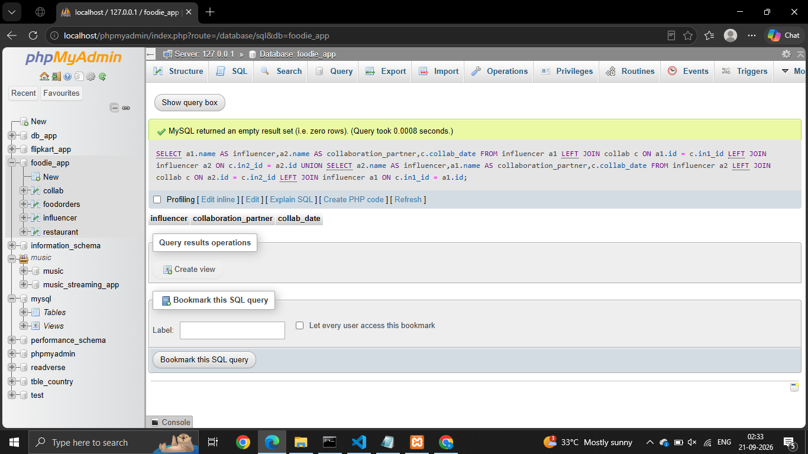
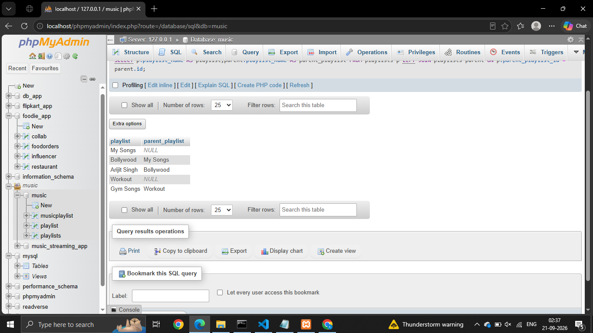
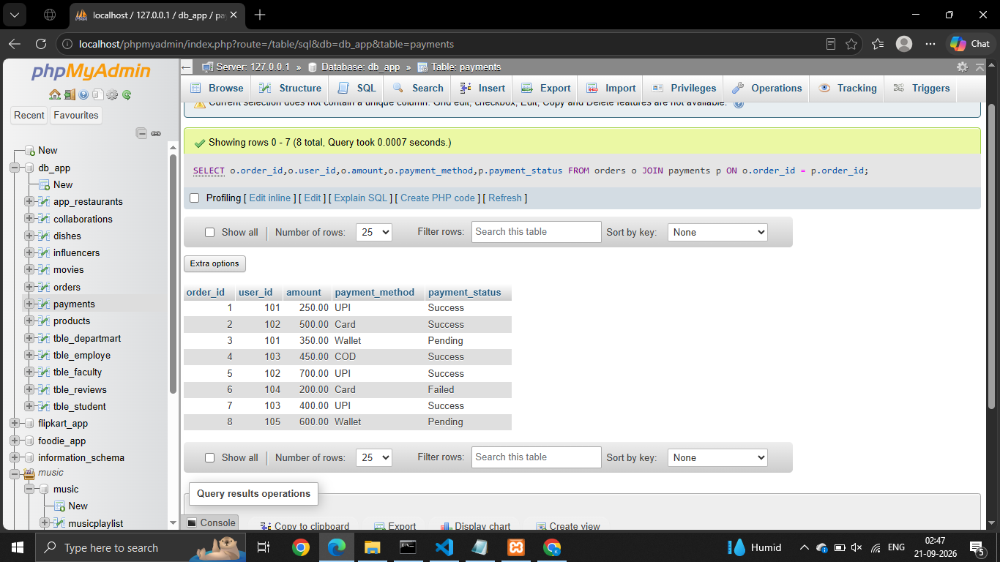
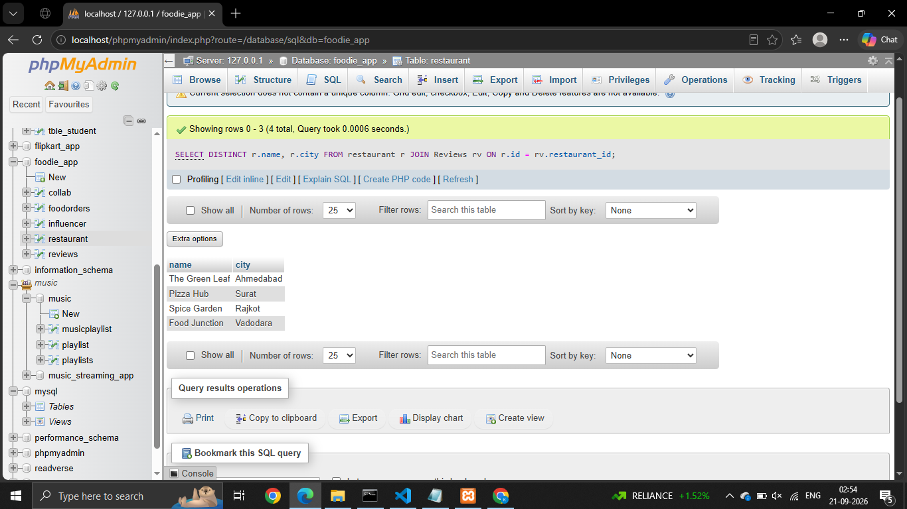
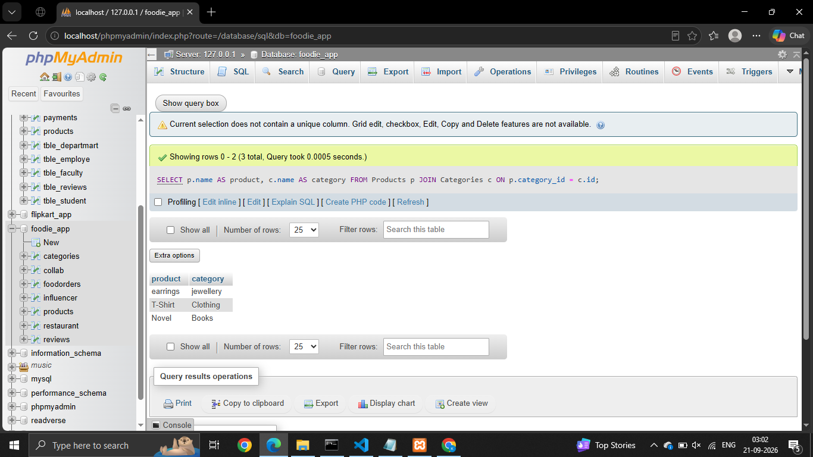
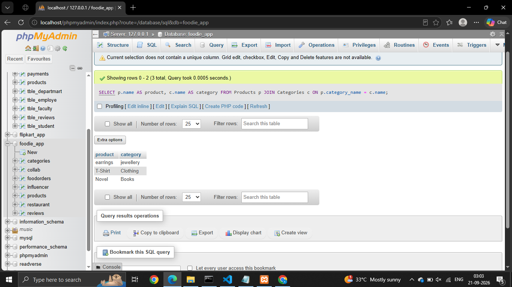

# Session - 10

# Que - 1
Create two tables: Influencers (id, name) and Collaborations (id, influencer1_id, influencer2_id, collab_date). Write a SQL FULL JOIN query to list all influencers and show their collaboration partner names if any, including influencers with no collaborations.

```
SELECT a1.name AS influencer,a2.name AS collaboration_partner,c.collab_date
FROM influencer a1 LEFT JOIN collab c ON a1.id = c.in1_id LEFT JOIN influencer a2 ON c.in2_id = a2.id
UNION
SELECT a2.name AS influencer,a1.name AS collaboration_partner,c.collab_date
FROM influencer a2 LEFT JOIN collab c ON a2.id = c.in2_id LEFT JOIN influencer a1 ON c.in1_id = a1.id;

```


# Que - 2
Using a SELF JOIN, write a query on a table called Playlists (id, user_id, playlist_name, parent_playlist_id) to display each playlist alongside its parent playlist name, similar to how Spotify shows nested playlists

```
SELECT p.playlist_name AS playlist,parent.playlist_name AS parent_playlist FROM playlists p LEFT JOIN playlists parent ON p.parent_playlist_id = parent.id;

```


# Que - 3
Given three tables: Users (id, username), Orders (id, user_id, order_date), and Payments (id, order_id, amount), write a SQL query using multiple JOINs to display each username, their order date, and payment amount, showing all users even if they have no orders or payments.

```
SELECT o.order_id,o.user_id,o.amount,o.payment_method,p.payment_status FROM orders o JOIN payments p ON o.order_id = p.order_id;

```


# Que - 4
You notice that your JOIN query between Zomato's Restaurants and Reviews tables is returning duplicate rows for some restaurants. Modify your query to eliminate duplicates and explain in one line why the duplicates were happening.
```
SELECT DISTINCT r.name, r.city FROM restaurant r JOIN Reviews rv ON r.id = rv.restaurant_id;

```


# Que - 5
Write two different JOIN queries on a Products and Categories table (like Flipkart) to list all products with their category names, but use different join conditions in each. Briefly explain which join condition is more efficient and why.

1st join
```
SELECT p.name AS product, c.name AS category FROM Products p JOIN Categories c ON p.category_id = c.id;
```



2nd join

```
SELECT p.name AS product, c.name AS category FROM Products p JOIN Categories c ON p.category_name = c.name;

```
