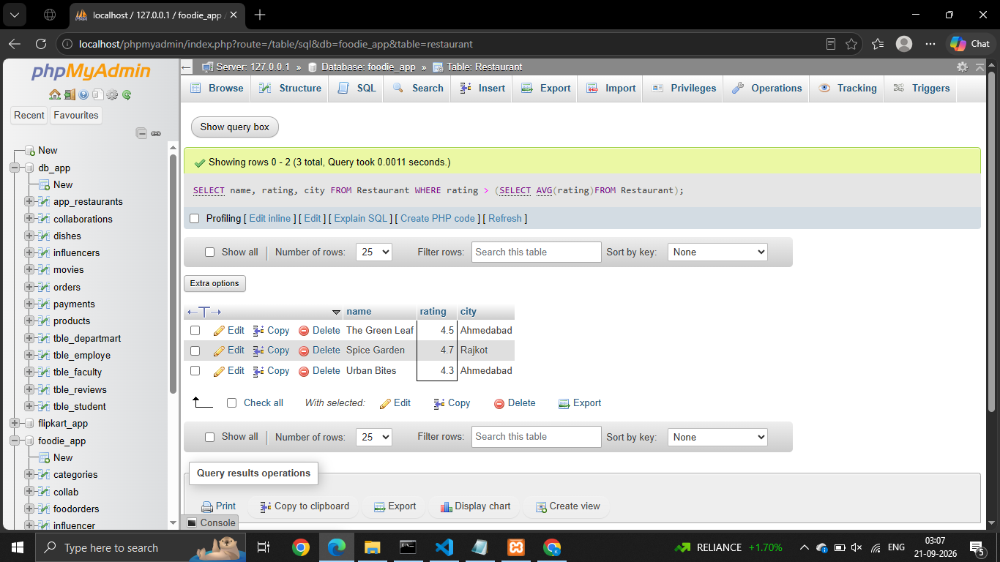
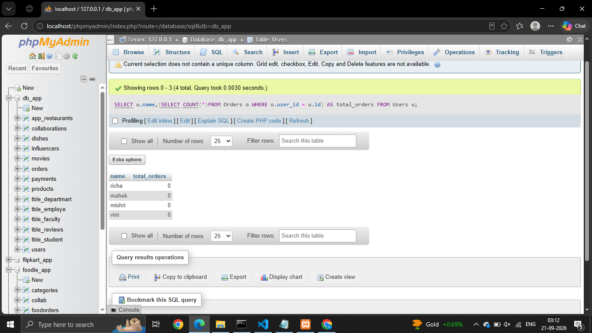
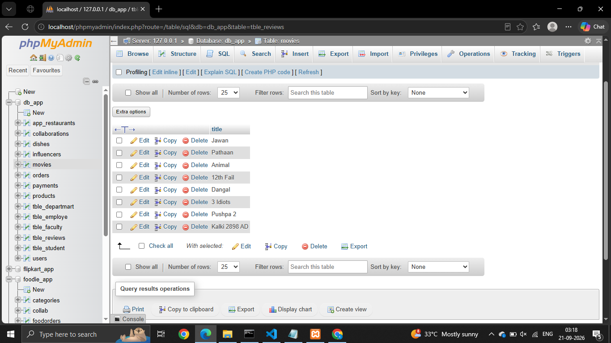
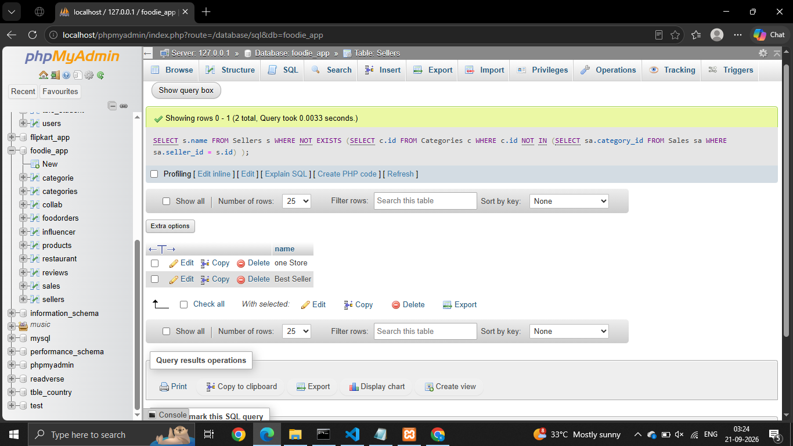

## Session - 11

# Que - 1
Create a SQL query using a subquery in the WHERE clause to find all restaurants from a 'Restaurants' table whose average rating is higher than the average rating of all restaurants in the city.

```
SELECT name, rating, city FROM Restaurant WHERE rating > (SELECT AVG(rating)FROM Restaurant);

```


# Que - 2
Write a SQL query that uses a subquery in the SELECT statement to display each user's name from a 'Users' table along with the total number of orders they have placed from an 'Orders' table, like a summary you might see in a Zomato user profile.

```
SELECT u.name,(SELECT COUNT(*)FROM Orders o WHERE o.user_id = u.id) AS total_orders FROM Users u;
```


# Que - 3
Given a 'Movies' table and a 'Reviews' table, write a SQL query using IN with a subquery to list all movies that have at least one review with a rating of 5 stars, as seen in BookMyShow's top-rated section.

```
SELECT title FROM movies WHERE id IN (SELECT id FROM tble_reviews WHERE rating = 5);

```


# Que - 4
Write a nested SQL query to find the names of all sellers from a 'Sellers' table on a Flipkart-style platform who have sold products in every category listed in a 'Categories' table.

```
SELECT s.name FROM Sellers s WHERE NOT EXISTS (SELECT c.id FROM Categories c WHERE c.id NOT IN (SELECT sa.category_id FROM Sales sa WHERE sa.seller_id = s.id)
);
```

