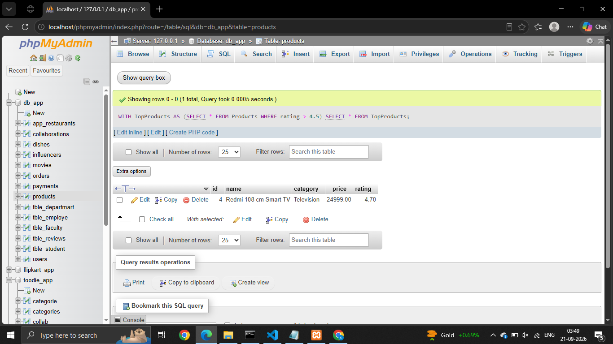
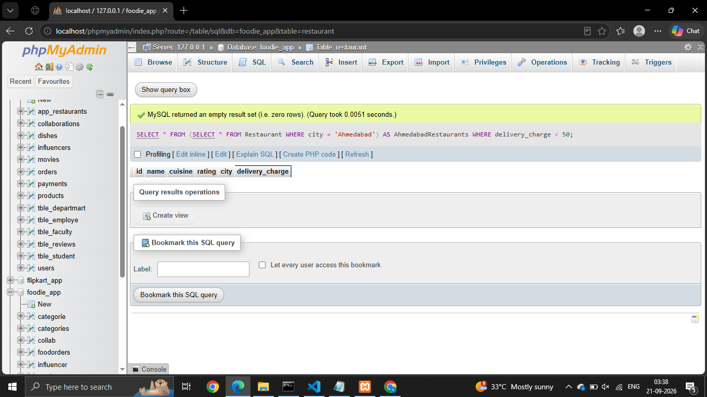
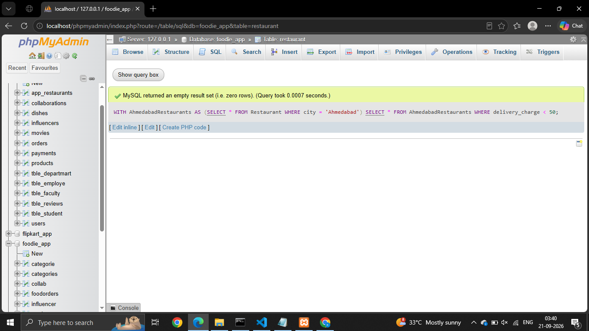
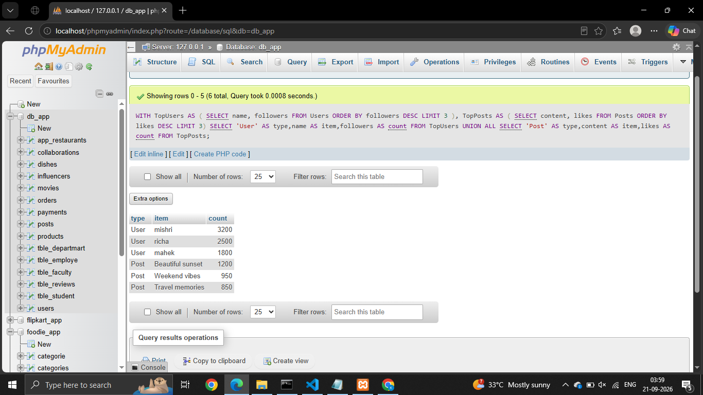
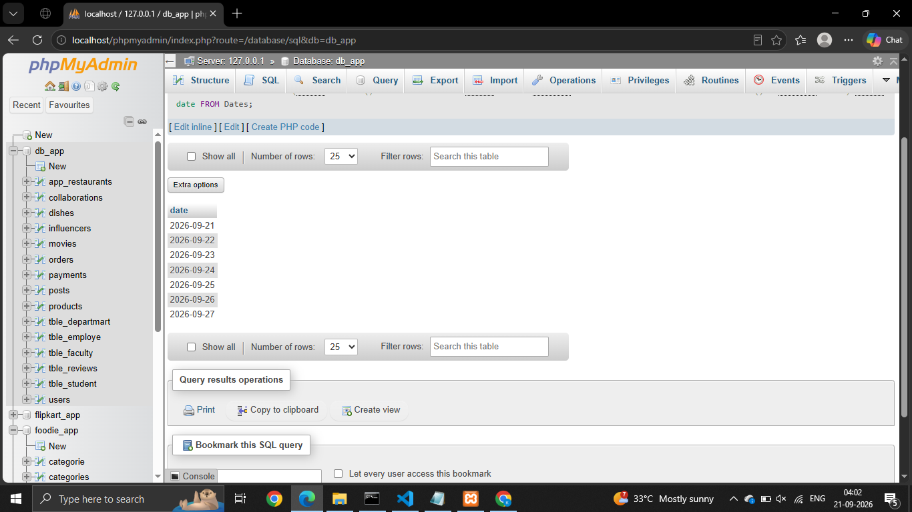
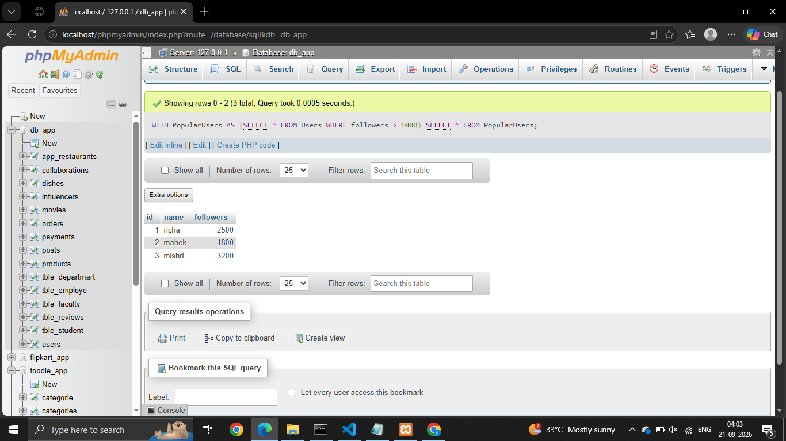

# Session - 12

# Que - 1
Create a CTE using the WITH clause to select all products with a rating above 4.5 from a 'Products' table, similar to how Flipkart or Myntra might highlight top-rated items.

```
WITH TopProducts AS (SELECT * FROM Products WHERE rating > 4.5)
SELECT * FROM TopProducts;
```


# Que - 2
Rewrite a query that finds all restaurants in 'Ahmedabad' with delivery charges under 50 from a 'Restaurants' table, first using a subquery and then using a CTE. Compare both queries for readability.

- Using subquerry
```
SELECT * FROM (SELECT * FROM Restaurant WHERE city = 'Ahmedabad') AS AhmedabadRestaurants WHERE delivery_charge < 50;
```

```
- Using CTE
```
WITH AhmedabadRestaurants AS (SELECT * FROM Restaurant WHERE city = 'Ahmedabad')
SELECT * FROM AhmedabadRestaurants WHERE delivery_charge < 50;
```

# Que - 3
Using two CTEs in a single query, find the top 3 most-followed users and the top 3 most-liked posts from a 'Users' and 'Posts' table (think Instagram-style data). Output both lists in the same result set.

```
WITH TopUsers AS (
    SELECT name, followers
    FROM Users
    ORDER BY followers DESC
    LIMIT 3
),
TopPosts AS ( SELECT content, likes FROM Posts ORDER BY likes DESC LIMIT 3)
SELECT 'User' AS type,name AS item,followers AS count
FROM TopUsers
UNION ALL
SELECT 'Post' AS type,content AS item,likes AS count FROM TopPosts;
```


# Que - 4
Write a recursive CTE that generates a list of dates for the next 7 days starting from today, similar to how BookMyShow shows available dates for movie bookings.

```
WITH RECURSIVE Dates AS (SELECT CURDATE() AS date UNION ALL SELECT date + INTERVAL 1 DAY FROM Dates WHERE date < CURDATE() + INTERVAL 6 DAY) SELECT date FROM Dates;
```


# Que - 5
Given a messy SQL query that finds all users with more than 1000 followers from a 'Users' table, refactor it to use a CTE for better clarity and maintainability.

```
WITH PopularUsers AS (SELECT * FROM Users WHERE followers > 1000)
SELECT * FROM PopularUsers;
```
