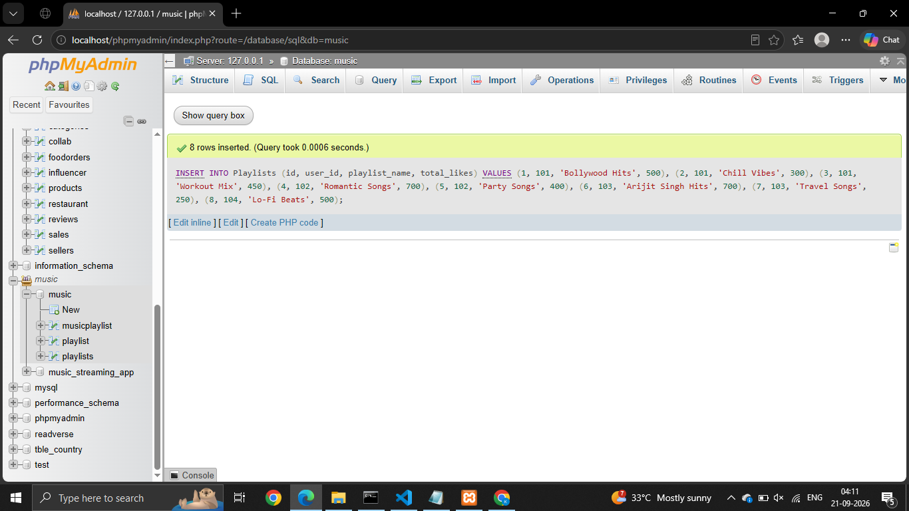
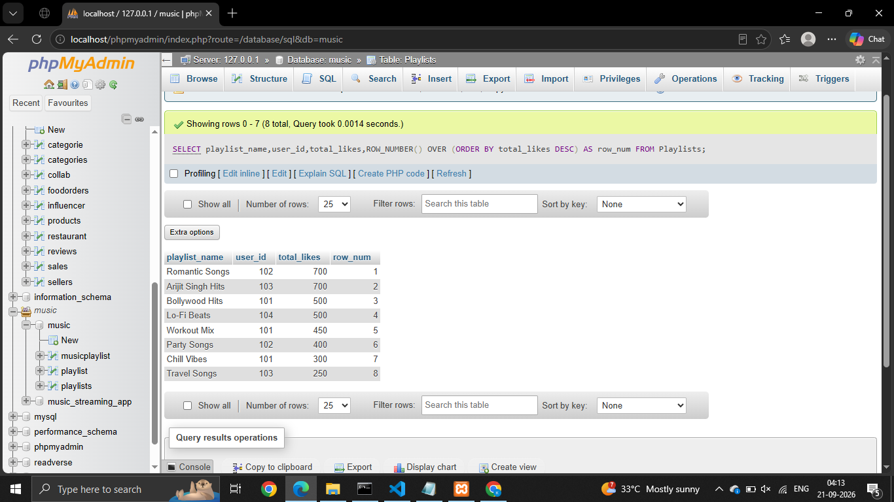
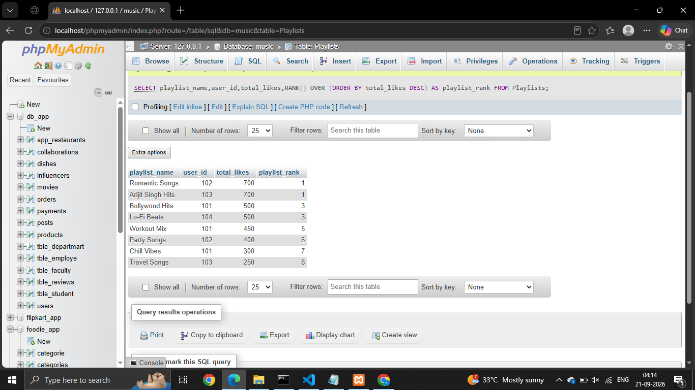
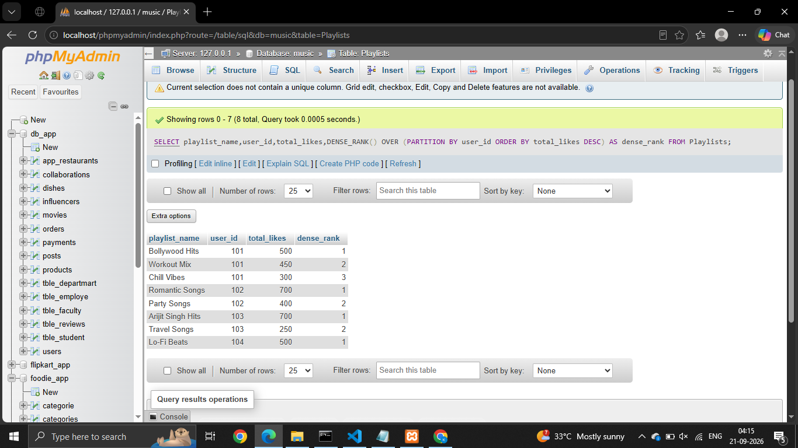
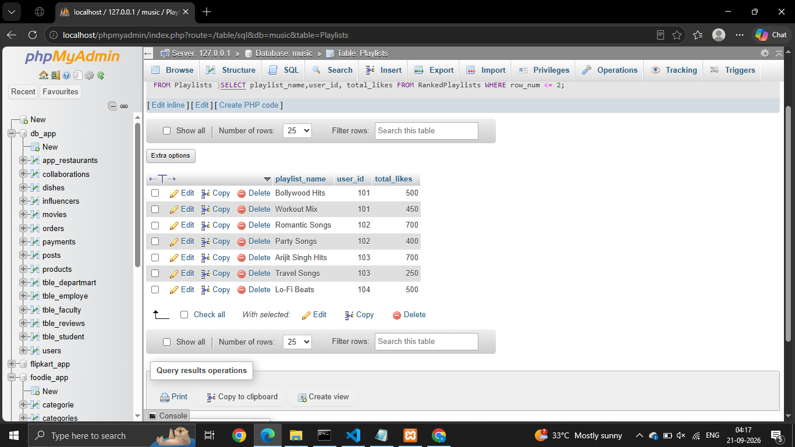

# Session - 13

# Que - 1
Create a table named Playlists with columns: id, user_id, playlist_name, and total_likes. Insert at least 8 sample rows with different users and playlists, making sure some playlists have the same user_id.

```
INSERT INTO Playlists (id, user_id, playlist_name, total_likes) VALUES
(1, 101, 'Bollywood Hits', 500),
(2, 101, 'Chill Vibes', 300),
(3, 101, 'Workout Mix', 450),
(4, 102, 'Romantic Songs', 700),
(5, 102, 'Party Songs', 400),
(6, 103, 'Arijit Singh Hits', 700),
(7, 103, 'Travel Songs', 250),
(8, 104, 'Lo-Fi Beats', 500);
``` 


# Que - 2
Write a SQL query using ROW_NUMBER() and the OVER() clause to assign a unique row number to each playlist, ordered by total_likes in descending order.
```
SELECT playlist_name,user_id,total_likes,ROW_NUMBER() OVER (ORDER BY total_likes DESC) AS row_num FROM Playlists;
``` 


# Que - 3
Use the RANK() function with the OVER() clause to rank all playlists by total_likes, and display the playlist_name, user_id, total_likes, and their rank.

```
SELECT playlist_name,user_id,total_likes,RANK() OVER (ORDER BY total_likes DESC) AS playlist_rank FROM Playlists;
``` 


# Que - 4
Write a SQL query using DENSE_RANK() and PARTITION BY user_id to rank each user's playlists by total_likes, showing playlist_name, user_id, total_likes, and dense rank

```
SELECT playlist_name,user_id,total_likes,DENSE_RANK() OVER (PARTITION BY user_id ORDER BY total_likes DESC) AS dense_rank FROM Playlists;
``` 


# Que - 5
Imagine you want to show the top 2 playlists per user based on total_likes, like Spotify's 'Your Top Playlists' feature. Write a query using a window function to select only the top 2 playlists for each user.

```
WITH RankedPlaylists AS (SELECT playlist_name,user_id,total_likes,ROW_NUMBER() OVER (PARTITION BY user_id ORDER BY total_likes DESC) AS row_num FROM Playlists )SELECT playlist_name,user_id, total_likes FROM RankedPlaylists WHERE row_num <= 2;
``` 
