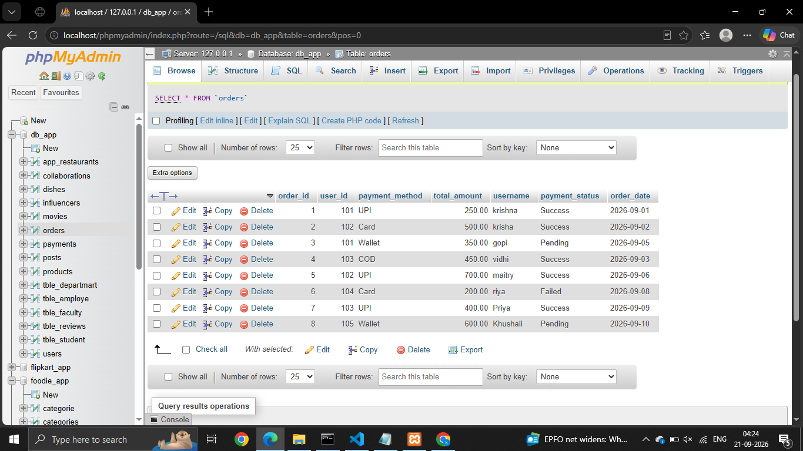
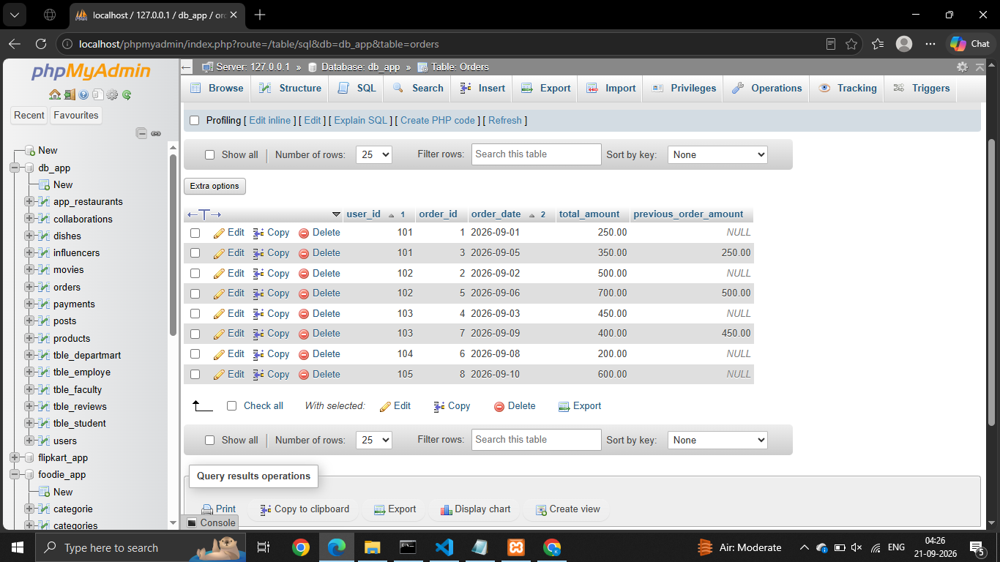
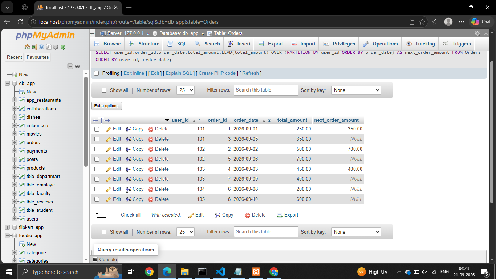
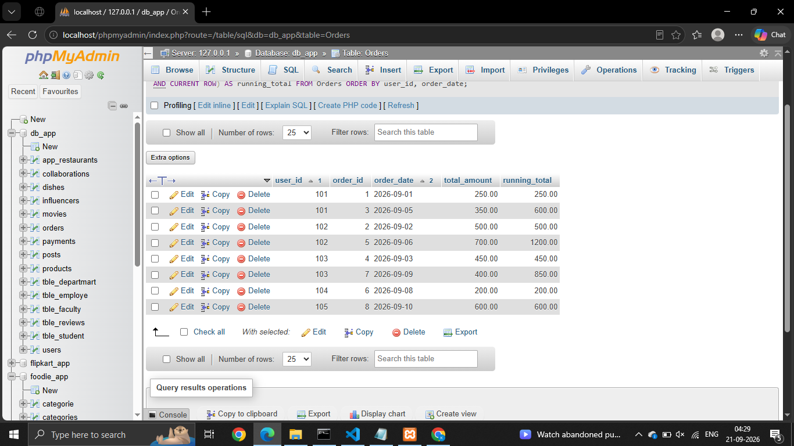
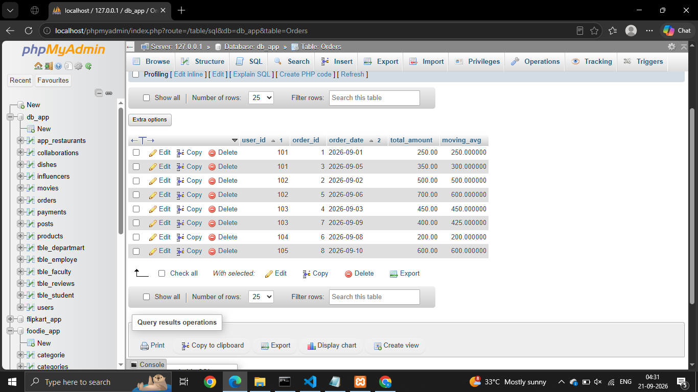

# Session - 14

# Que - 1
Create a table called Orders with columns: order_id, user_id, order_date, and total_amount. Insert at least 7 sample rows representing different users and dates, similar to how food orders appear in Zomato or Swiggy.



# Que - 2
Write a SQL query using the LAG() function to show each user's order_id, order_date, and the total_amount of their previous order (if any), ordered by user and date.

```
SELECT user_id,order_id,order_date,total_amount,LAG(total_amount) OVER (PARTITION BY user_id ORDER BY order_date) AS previous_order_amount FROM Orders ORDER BY user_id, order_date;

```


# Que - 3
Using the same Orders table, write a SQL query with the LEAD() function to display each order_id, order_date, and the next order's total_amount for the same user.

```
SELECT user_id,order_id,order_date,total_amount,LEAD(total_amount) OVER (PARTITION BY user_id ORDER BY order_date) AS next_order_amount FROM Orders ORDER BY user_id, order_date;
```


# Que - 4
Write a SQL query to calculate the running total of total_amount for each user, showing order_id, order_date, total_amount, and a column running_total that accumulates the sum as you move through each user's orders.

```
SELECT user_id,order_id,order_date,total_amount,SUM(total_amount) OVER (PARTITION BY user_id ORDER BY order_date ROWS BETWEEN UNBOUNDED PRECEDING AND CURRENT ROW) AS running_total FROM Orders ORDER BY user_id, order_date;
```


# Que - 5
Write a SQL query to calculate a 3-order moving average of total_amount for each user, showing order_id, order_date, total_amount, and moving_avg columns.

```
SELECT user_id,order_id,order_date,total_amount,SUM(total_amount) OVER (PARTITION BY user_id ORDER BY order_date ROWS BETWEEN 2 PRECEDING AND CURRENT ROW ) / COUNT(*) OVER (PARTITION BY user_id ORDER BY order_date ROWS BETWEEN 2 PRECEDING AND CURRENT ROW) AS moving_avg
FROM Orders ORDER BY user_id, order_date;
```
