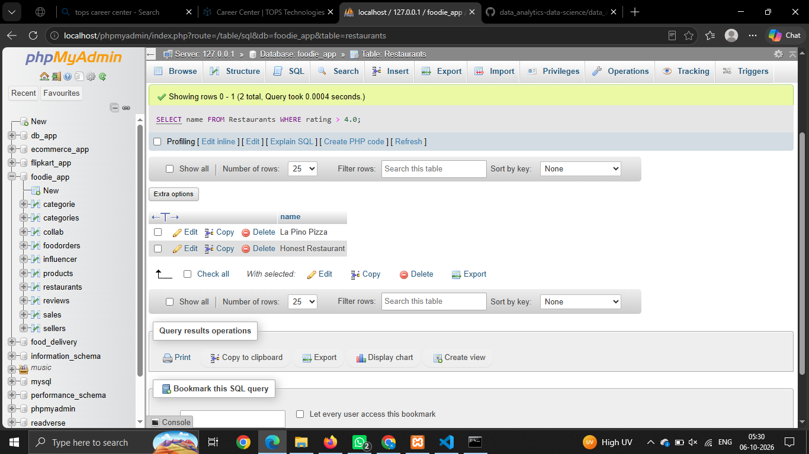

# Session -15 

# Que - 1
Install the sqlite3 module in Python and write a script to create a new database called foodie.db with a table Restaurants (id, name, cuisine, rating).
```
CREATE TABLE Restaurants (
    id INT PRIMARY KEY,
    name VARCHAR(100),
    cuisine VARCHAR(50),
    rating DECIMAL(3,1)
);

INSERT INTO Restaurants (id, name, cuisine, rating)VALUES(1, 'La Pino Pizza', 'Italian', 4.5),(2, 'Honest Restaurant', 'Indian', 4.2),(3, 'Wok This Way', 'Chinese', 3.8);

SELECT name FROM Restaurants WHERE rating > 4.0;
```


# Que - 2
Using sqlite3 in Python, insert three sample restaurants into the Restaurants table in foodie.db and write a query to fetch all restaurants with a rating above 4.0, then print their names.
```
import mysql.connector
import pandas as pd

conn = mysql.connector.connect(
    host="localhost",
    user="root",
    password="",
    database="foodie_db"
)
query = "SELECT * FROM Restaurants"
df = pd.read_sql(query, conn)
print(df.head(2))
conn.close()
```

# Que - 3
Write Python code to load all rows from the Restaurants table in foodie.db into a Pandas DataFrame and display the top 2 rows using DataFrame.head().
```
import mysql.connector
import pandas as pd

conn = mysql.connector.connect(
    host="localhost",
    user="root",
    password="",
    database="foodie_db"
)

query = "SELECT * FROM Restaurants"

df = pd.read_sql(query, conn)

print(df.head(2))

conn.close()
```

# Que - 4
Add a new column 'delivery_charge' to your DataFrame, setting it to 50 for all restaurants, and then calculate a new column 'final_rating' as rating + (0.1 if cuisine is 'Italian').
```
import mysql.connector
import pandas as pd

conn = mysql.connector.connect(
    host="localhost",
    user="root",
    password="",
    database="foodie_db"
)

df = pd.read_sql("SELECT * FROM Restaurants", conn)

# Add delivery charge
df["delivery_charge"] = 50

# Calculate final rating
df["final_rating"] = df.apply(
    lambda row: row["rating"] + 0.1
    if row["cuisine"] == "Italian"
    else row["rating"],
    axis=1
)

print(df)

conn.close()
```

# Que - 5
Automate a daily summary: Write a Python script that connects to foodie.db, fetches all restaurants with rating above 4.5, loads them into a DataFrame, and saves the result as a CSV file named top_rated_restaurants.csv.
```
import mysql.connector
import pandas as pd

conn = mysql.connector.connect(
    host="localhost",
    user="root",
    password="",
    database="foodie_db"
)

query = """
SELECT *
FROM Restaurants
WHERE rating > 4.5
"""

df = pd.read_sql(query, conn)

df.to_csv("top_rated_restaurants.csv", index=False)

print("CSV file created successfully.")

conn.close()
```