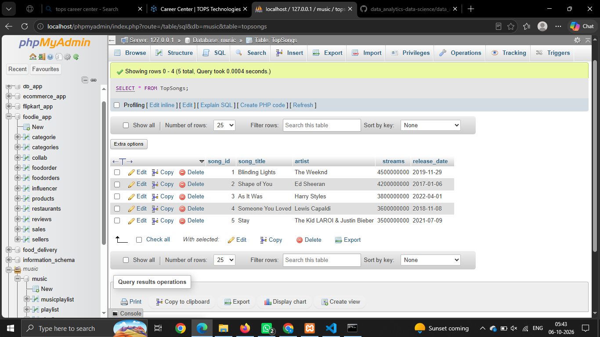
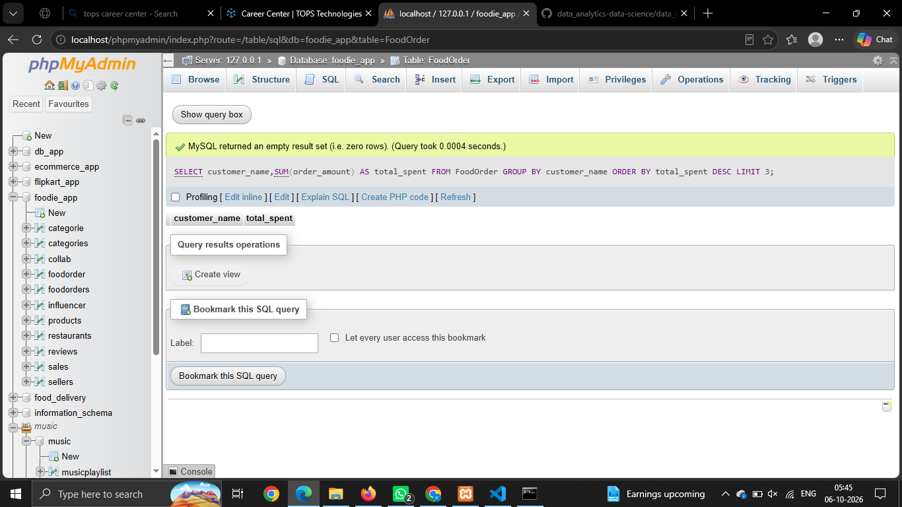

# Session - 16

# Que - 1
Import a CSV file of food delivery orders (with columns like order_id, restaurant_name, customer_name, order_amount, order_date) into a new SQL table named FoodOrders using your database tool of choice.

```
CREATE TABLE FoodOrder (
    order_id INT PRIMARY KEY,
    restaurant_name VARCHAR(100),
    customer_name VARCHAR(100),
    order_amount DECIMAL(10,2),
    order_date DATE
);
```

# Que - 2 
Write SQL statements to create a table called TopSongs with columns: song_id, song_title, artist, streams, and release_date, then insert at least 5 records representing popular tracks from Spotify.
```
CREATE TABLE TopSongs (
    song_id INT PRIMARY KEY,
    song_title VARCHAR(200),
    artist VARCHAR(100),
    streams BIGINT,
    release_date DATE
);

INSERT INTO TopSongs(song_id, song_title, artist, streams, release_date)VALUES(1, 'Blinding Lights', 'The Weeknd', 4500000000, '2019-11-29'),(2, 'Shape of You', 'Ed Sheeran', 4200000000, '2017-01-06'),(3, 'As It Was', 'Harry Styles', 3800000000, '2022-04-01'),(4, 'Someone You Loved', 'Lewis Capaldi', 3600000000, '2018-11-08'),(5, 'Stay', 'The Kid LAROI & Justin Bieber', 3500000000, '2021-07-09');
```


# Que - 3
Write an SQL query to find the top 3 customers who ordered the most from the FoodOrders table based on total order_amount, and display their names and total spent.
```
SELECT customer_name,SUM(order_amount) AS total_spent FROM FoodOrder GROUP BY customer_name ORDER BY total_spent DESC LIMIT 3;
```


# Que - 4 
Generate a product performance report by writing an SQL query that lists each restaurant_name from FoodOrders, the number of orders, and the total order_amount, ordered by total order_amount descending.
```
SELECT restaurant_name,COUNT(order_id) AS number_of_orders,SUM(order_amount) AS total_order_amount FROM FoodOrder GROUP BY restaurant_name ORDER BY total_order_amount DESC;
```

# Que - 5
Create an SQL query that calculates two KPIs for the FoodOrders table: (1) average order_amount and (2) total number of unique customers, and format the output for dashboard display (two columns: kpi_name, kpi_value).
```
SELECT 'Average Order Amount' AS kpi_name,ROUND(AVG(order_amount), 2) AS kpi_value FROM FoodOrder UNION ALL SELECT'Total Unique Customers' AS kpi_name,COUNT(DISTINCT customer_name) AS kpi_value FROM FoodOrder;
```