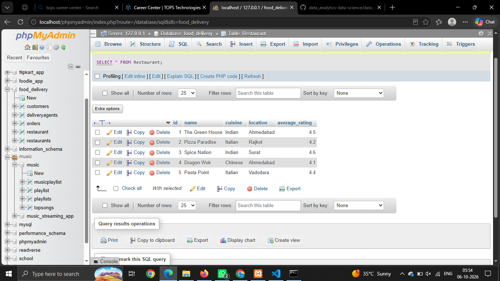
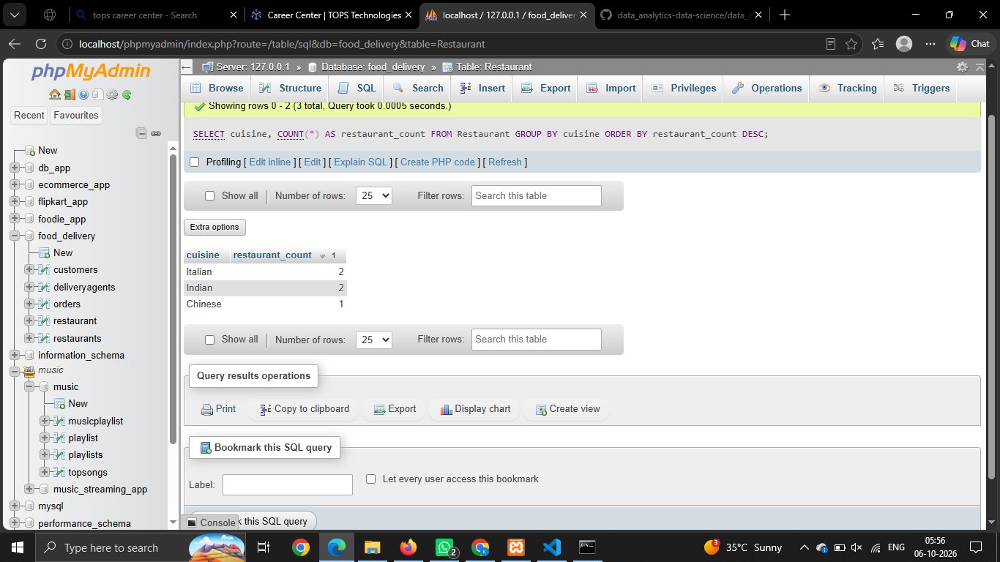
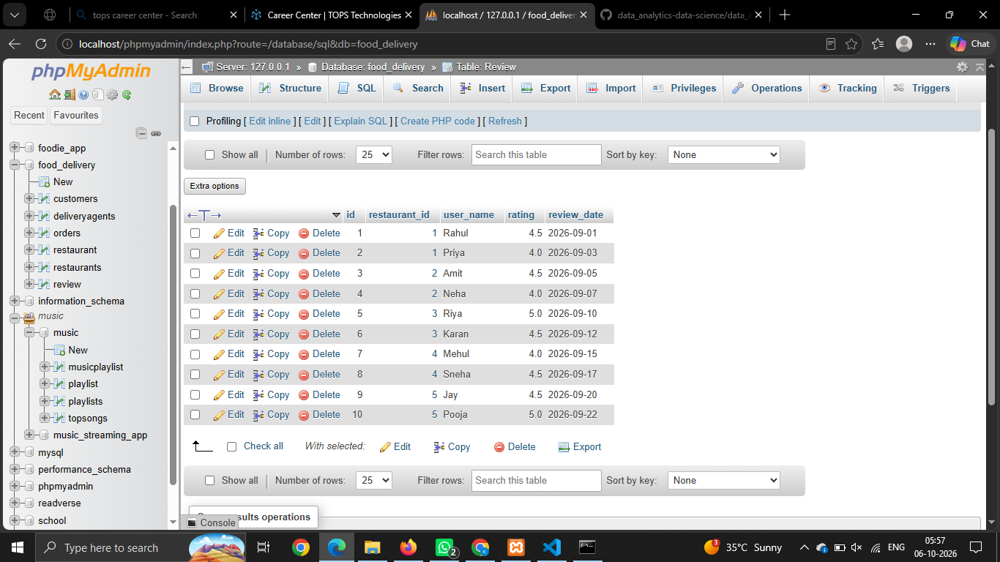
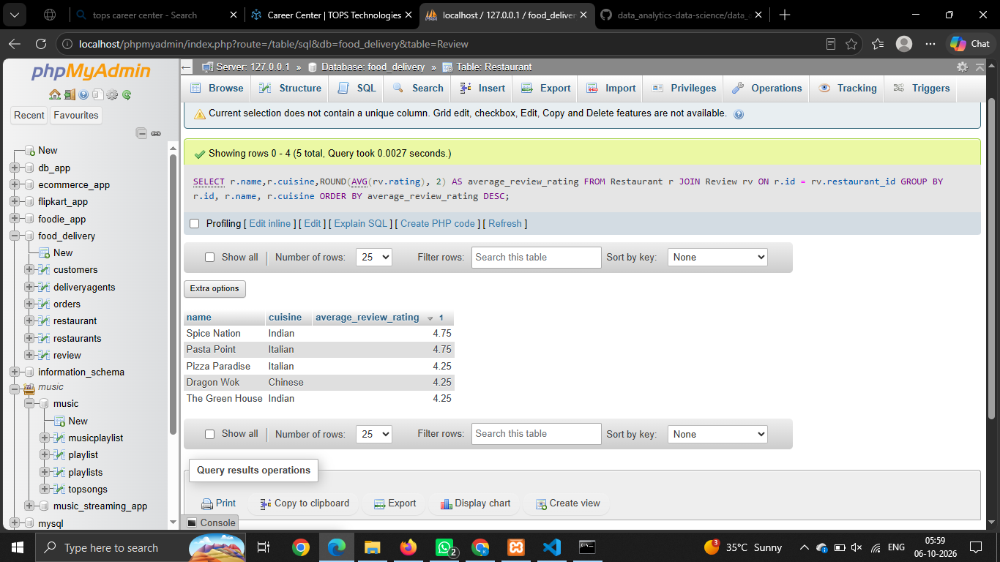
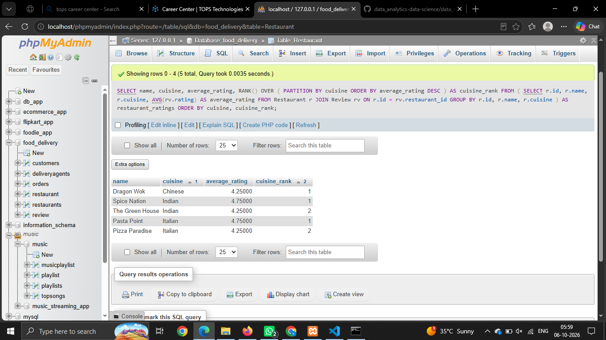

# Session - 17

# Que - 1
Create a SQL table called Restaurant with columns: id, name, cuisine, location, and average_rating. Insert at least 5 sample rows representing popular restaurants from Zomato.
```
CREATE TABLE Restaurant (
    id INT PRIMARY KEY,
    name VARCHAR(100),
    cuisine VARCHAR(50),
    location VARCHAR(100),
    average_rating DECIMAL(3,1)
);
```


# Que - 2
Write a SQL query to generate a report showing the number of restaurants for each cuisine type from your Restaurant table, ordered by the count in descending order.
```
SELECT cuisine, COUNT(*) AS restaurant_count FROM Restaurant GROUP BY cuisine ORDER BY restaurant_count DESC;
```


# Que - 3
Add a new table called Review with columns: id, restaurant_id, user_name, rating, and review_date. Insert at least 10 sample reviews, linking them to restaurants using restaurant_id.
```
CREATE TABLE Review (
    id INT PRIMARY KEY,
    restaurant_id INT,
    user_name VARCHAR(100),
    rating DECIMAL(2,1),
    review_date DATE,
    FOREIGN KEY (restaurant_id) REFERENCES Restaurant(id)
);
```


# Que - 4
Write a SQL query using a JOIN to display each restaurant's name, cuisine, and its average review rating (from the Review table), ordered by highest average rating first.
```
SELECT r.name,r.cuisine,ROUND(AVG(rv.rating), 2) AS average_review_rating FROM Restaurant r JOIN Review rv ON r.id = rv.restaurant_id GROUP BY r.id, r.name, r.cuisine ORDER BY average_review_rating DESC;
```


# Que - 5
Use a window function to rank restaurants by their average review rating within each cuisine type, showing the restaurant name, cuisine, average rating, and rank.
```
SELECT
    name,
    cuisine,
    average_rating,
    RANK() OVER (
        PARTITION BY cuisine
        ORDER BY average_rating DESC
    ) AS cuisine_rank
FROM
(
    SELECT
        r.id,
        r.name,
        r.cuisine,
        AVG(rv.rating) AS average_rating
    FROM Restaurant r
    JOIN Review rv
        ON r.id = rv.restaurant_id
    GROUP BY r.id, r.name, r.cuisine
) AS restaurant_ratings
ORDER BY cuisine, cuisine_rank;
```
