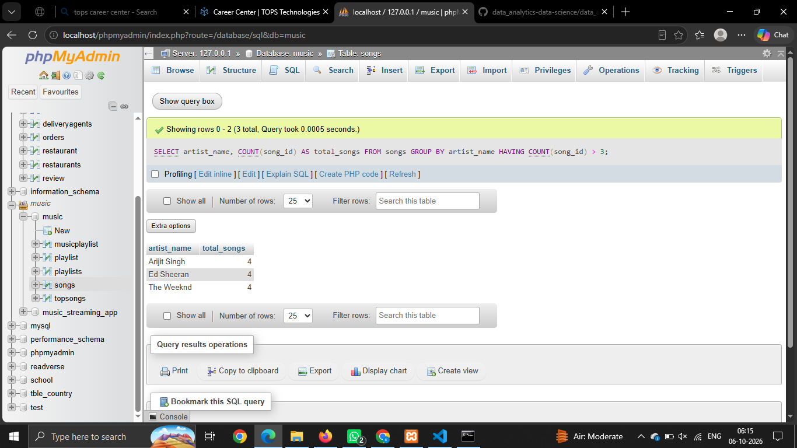
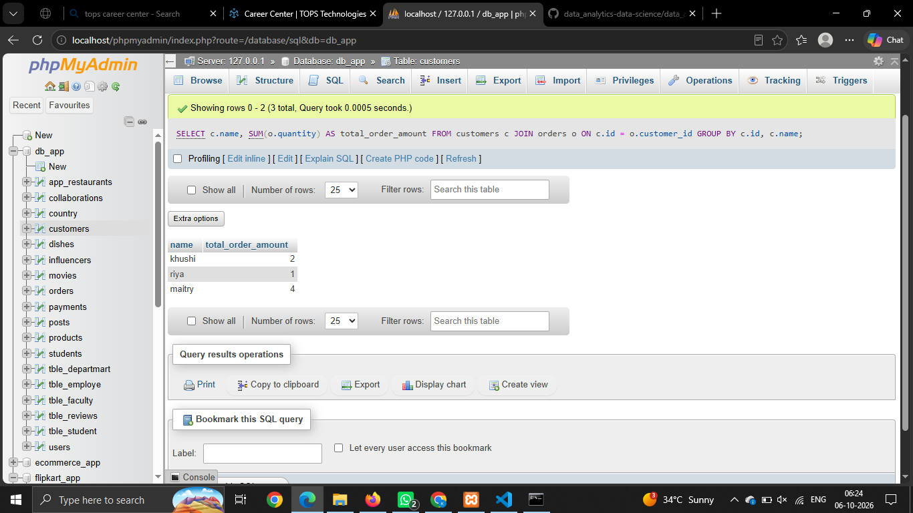
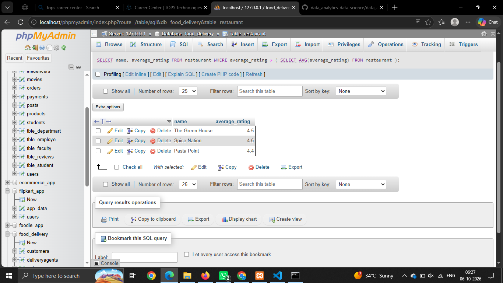
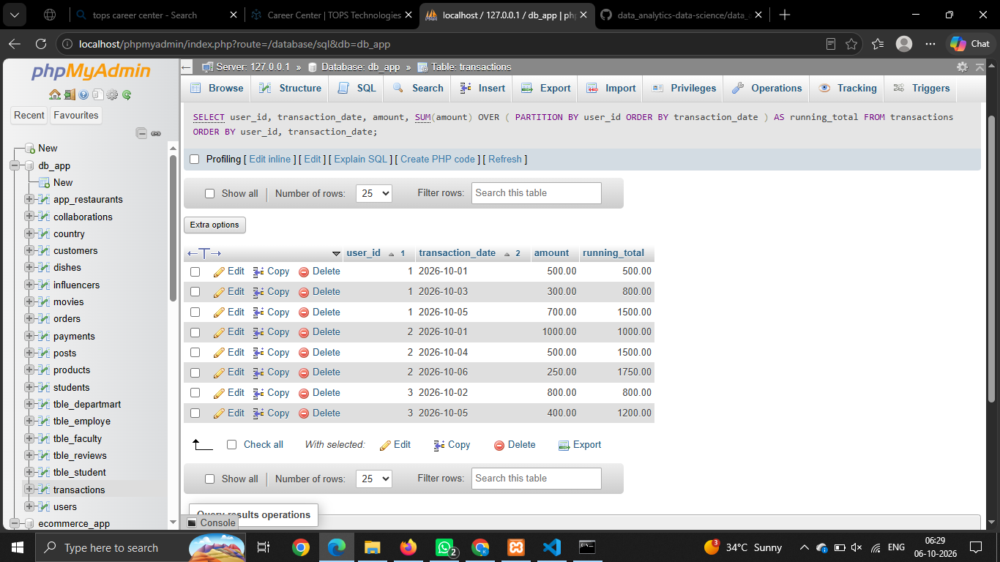
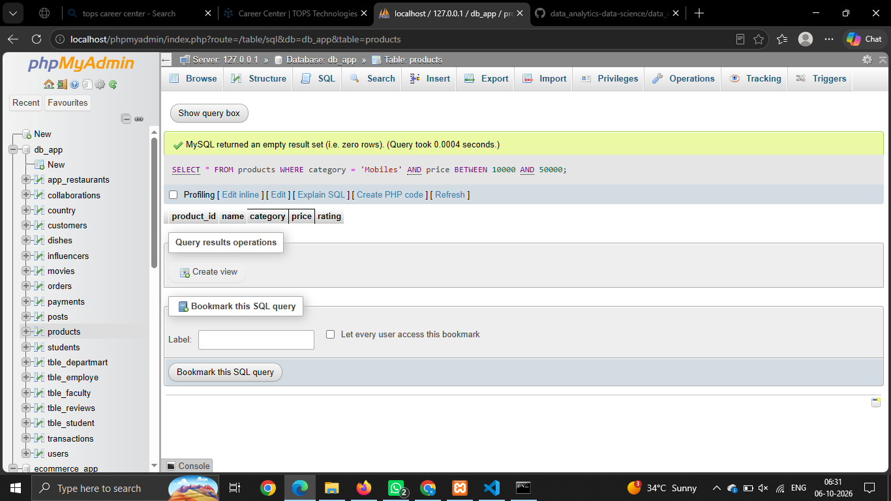

# Session - 18 

# Que - 1
Write an SQL query to display the total number of songs uploaded by each artist from a table 'songs' (columns: song_id, artist_name, title) and show only those artists who have uploaded more than 3 songs.
```
SELECT
    artist_name,
    COUNT(song_id) AS total_songs
FROM songs
GROUP BY artist_name
HAVING COUNT(song_id) > 3;
```


# Que - 2
Given two tables, 'orders' (order_id, user_id, amount) and 'users' (user_id, username), write a SQL JOIN query to display each username along with their total order amount.
```
SELECT
    c.name,
    SUM(o.quantity) AS total_order_amount
FROM customers c
JOIN orders o
    ON c.id = o.customer_id
GROUP BY c.id, c.name;
```


# Que - 3
Write a SQL subquery to find the names of all restaurants from a 'restaurants' table (id, name, rating) whose rating is higher than the average rating of all restaurants.
```
SELECT
    name,
    average_rating
FROM restaurant
WHERE average_rating > (
    SELECT AVG(average_rating)
    FROM restaurant
);
```


# Que - 4
Using a 'transactions' table (id, user_id, amount, transaction_date), write a SQL query with a window function to display each user's transaction amount and their running total (cumulative sum) ordered by transaction_date.
```
SELECT
    user_id,
    transaction_date,
    amount,
    SUM(amount) OVER (
        PARTITION BY user_id
        ORDER BY transaction_date
    ) AS running_total
FROM transactions
ORDER BY user_id, transaction_date;
```


# Que - 5
List two optimizations you would apply to speed up a query that filters Flipkart products by category and price, and briefly explain how each helps
```
SELECT *
FROM products
WHERE category = 'Mobiles'
AND price BETWEEN 10000 AND 50000;
```

