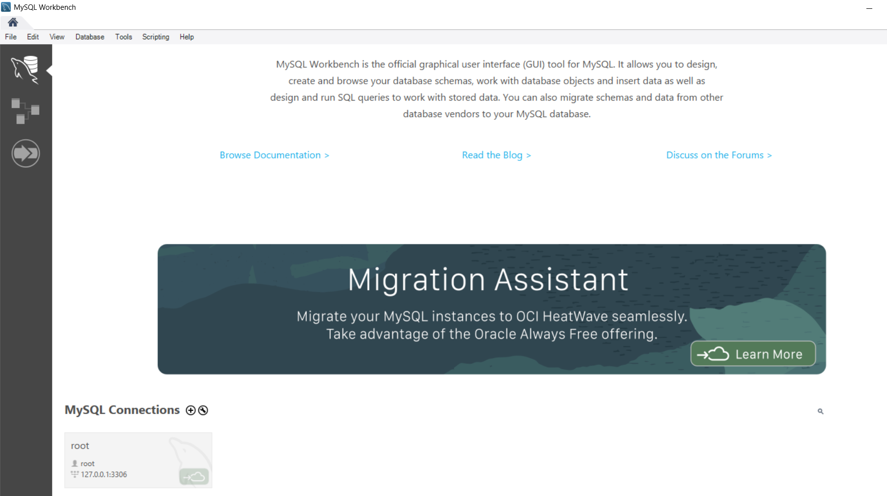
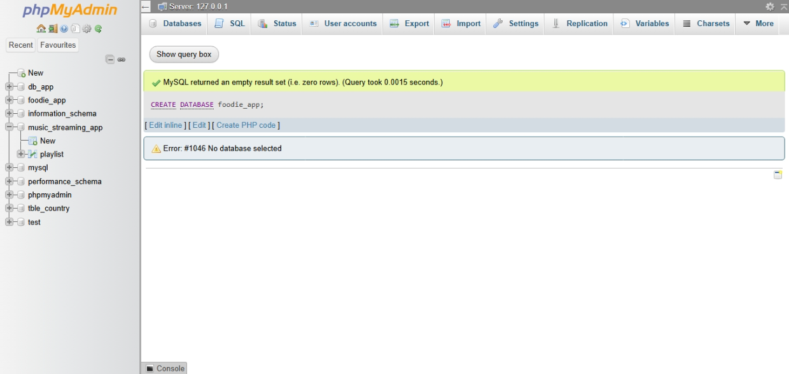
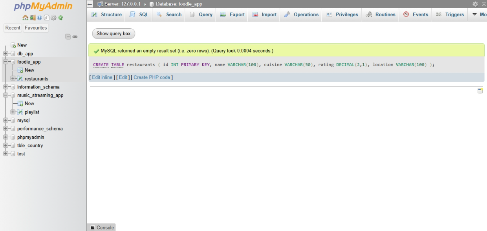
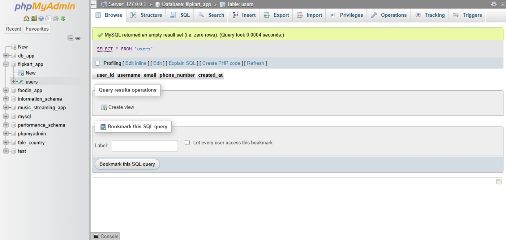
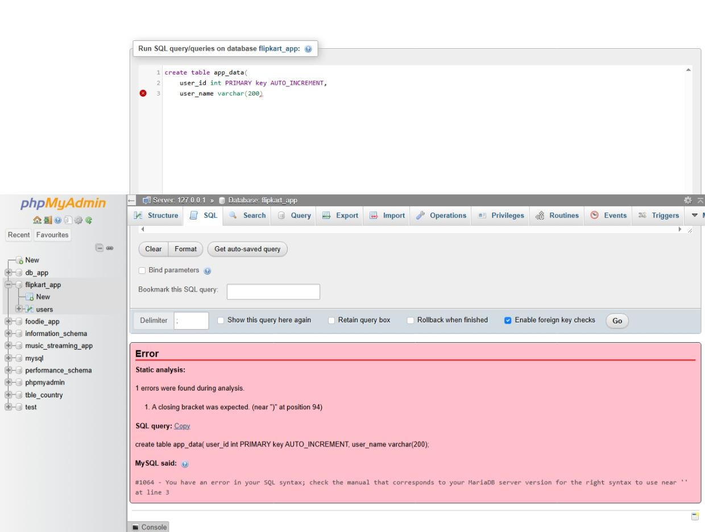
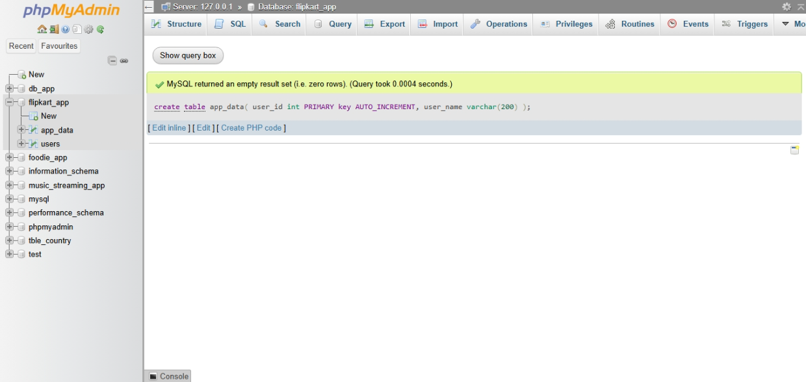

## SESSION-2

1. Install MySQL Community Server or SQLite on your system and verify the installation by connecting to the database using the command line or a GUI tool like MySQL Workbench or DB Browser for SQLite.



2. Create a new database named 'foodie_app' to simulate a Zomato-style backend.

```
CREATE DATABASE foodie_app;

```


3. Write a CREATE TABLE statement to define a 'restaurants' table in the 'foodie_app' database with the following columns: id (integer, primary key), name (varchar/character, max 100), cuisine (varchar/character, max 50), rating (decimal, e.g., 4.5), and location (varchar/character, max 100)

```
CREATE TABLE restaurants (
    id INT PRIMARY KEY,
    name VARCHAR(100),
    cuisine VARCHAR(50),
    rating DECIMAL(2,1),
    location VARCHAR(100)
);
```



4. Design and create a 'users' table for a Flipkart-style app with columns: user_id (primary key), username, email, phone_number, and created_at (date/time). Pick appropriate data types for each column.

```
create database flipkart_app;

```
```
create table users(
    user_id int PRIMARY KEY AUTO_INCREMENT,
    username varchar(250) NOT null UNIQUE,
    email varchar(250) NOT null UNIQUE,
    phone_number varchar(20) NOT null UNIQUE,
    created_at datetime DEFAULT CURRENT_TIMESTAMP
);

```



5. Intentionally make a mistake in your CREATE TABLE statement (such as missing a comma or using an unsupported data type), run it, and then fix the error based on the message you receive.





