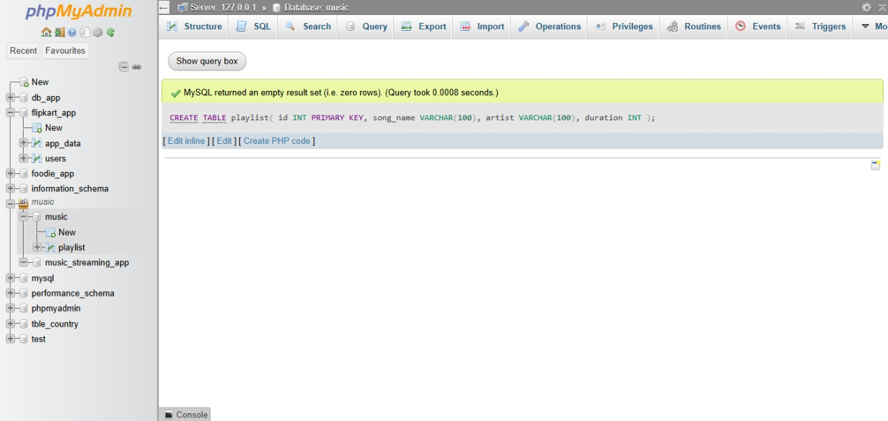
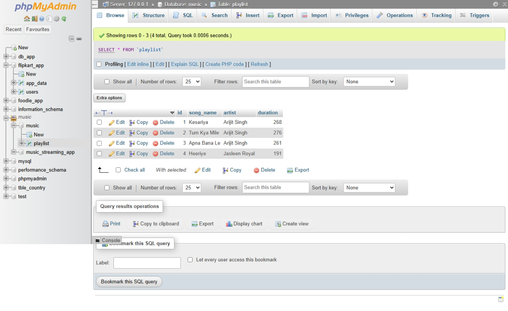

## SESSION - 3

1. Create a table called Playlist with columns: id (INT, primary key), song_name (VARCHAR), artist (VARCHAR), and duration (INT, seconds). Insert a single row for your current favorite song.

```
CREATE TABLE playlist(
    id INT PRIMARY KEY,
    song_name VARCHAR(100),
    artist VARCHAR(100),
    duration INT
);
```


```
INSERT INTO Playlist (id, song_name, artist, duration)
VALUES (1, 'Kesariya', 'Arijit Singh', 268);
```

2. Insert 3 new rows into the Playlist table for songs you recently listened to on Spotify, including their song_name, artist, and duration.

```
INSERT INTO Playlist (id, song_name, artist, duration)
VALUES
(2, 'Tum Kya Mile', 'Arijit Singh', 276),
(3, 'Apna Bana Le', 'Arijit Singh', 261),
(4, 'Heeriye', 'Jasleen Royal', 191);

```



3. Update the artist name for one of your Playlist entries to fix a typo (for example, change 'Arjit Singh' to 'Arijit Singh') using the UPDATE statement with a WHERE clause.

```
UPDATE Playlist SET artist = 'Jasleen Royal'WHERE artist = 'Jasleen kaur Royal';

```

4. Delete a song from the Playlist table where the duration is less than 120 seconds using the DELETE statement and a WHERE clause.

```
DELETE from playlist where song_name="Tum kya mile";

```

5. Write an SQL statement that would update the song_name for all songs by 'AP Dhillon' in your Playlist to add '(Remix)' at the end of the name, but only if the duration is more than 180 seconds.

```
UPDATE Playlist SET song_name = CONCAT(song_name, ' (Remix)') WHERE artist = 'AP Dhillon' 
AND duration > 180;

```