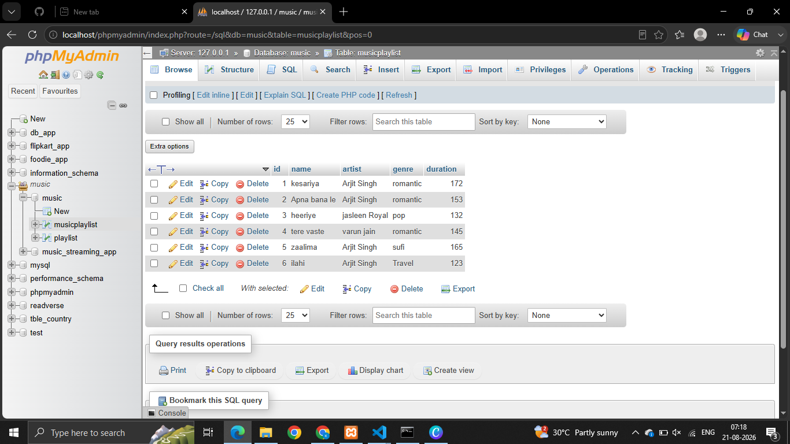
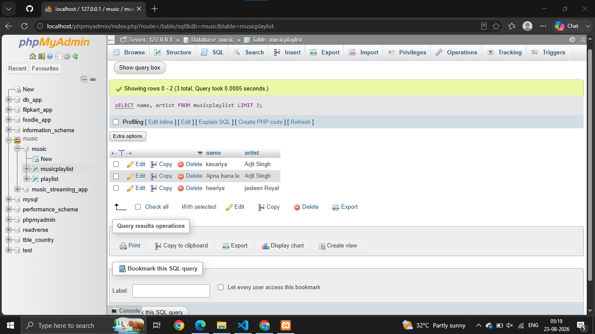
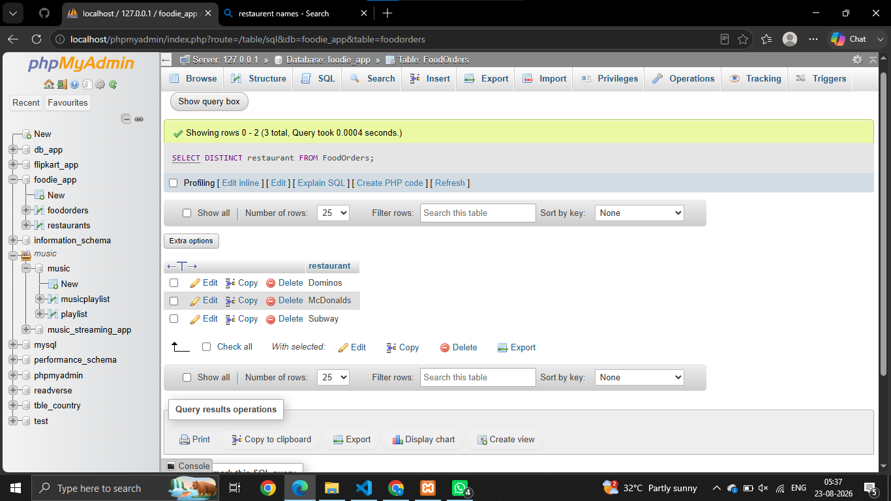
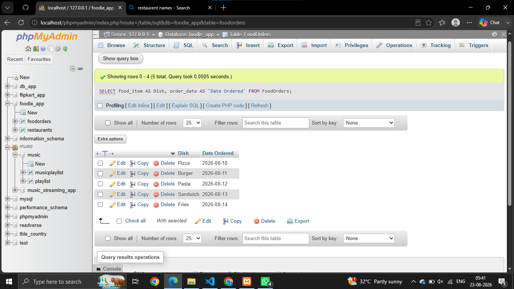
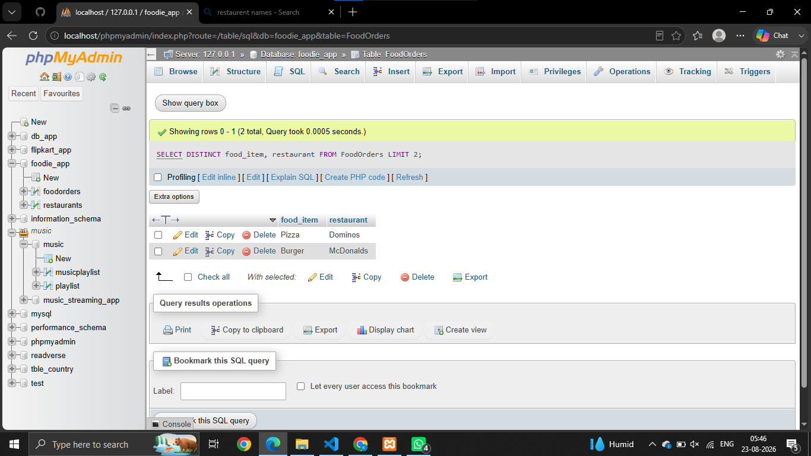

# SESSION - 4

# Que : 1
Create a table named MusicPlaylist with columns: id, song_name, artist, genre, and duration. Insert at least 5 records representing songs from your favorite Spotify playlist, then write a SELECT statement to retrieve all columns for all songs.

```
create table MusicPlaylist(
    id int AUTO_INCREMENT PRIMARY key,
    name varchar(255),
    artist varchar(255),
    genre varchar(255),
    duration bigint
    );

    Select * from playlist;
```


# Que : 2
Write a SQL query to display only the song_name and artist columns from the MusicPlaylist table, showing just the first 3 records using the LIMIT keyword.

```
SELECT name, artist FROM musicplaylist LIMIT 3;

```



# Que : 3
Suppose you have a table named FoodOrders with columns: id, restaurant, food_item, and order_date. Write a SQL query to list all unique restaurant names where you have placed orders, using the DISTINCT keyword.

```
SELECT DISTINCT restaurant FROM FoodOrders;

```



# Que: 4
Write a SQL query on the FoodOrders table to select food_item as 'Dish' and order_date as 'Date Ordered', displaying only these two columns with the column aliases in the output.

```
SELECT food_item AS Dish, order_date AS `Date Ordered` FROM FoodOrders;

```


# Que : 5
You tried running this query: SELECT DISTINCT food_item, restaurant FROM FoodOrders LIMIT 2, but it returns an error or doesn't work as expected. Identify and fix the mistake in the query.

```
SELECT DISTINCT food_item, restaurant FROM FoodOrders LIMIT 2;

```



