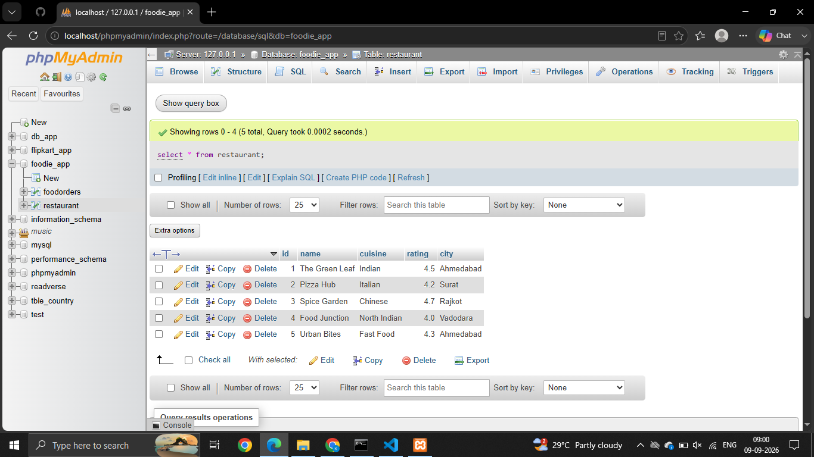
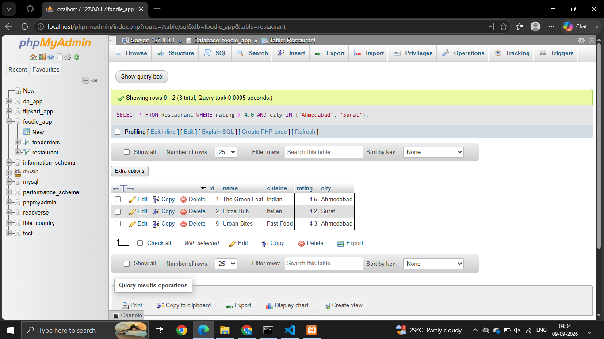
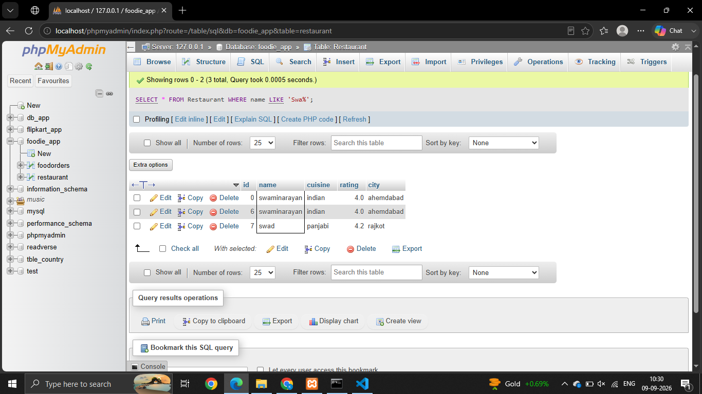
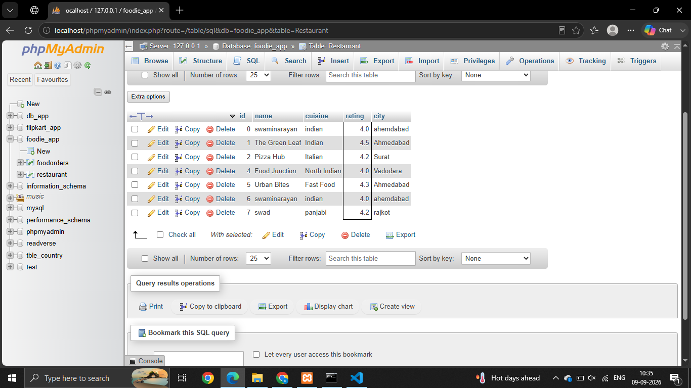
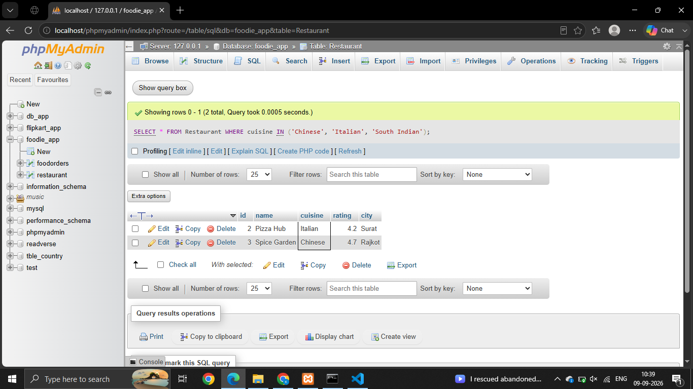

# Session - 5 

# Que - 1
Create a table called Restaurants with columns: id, name, cuisine, rating, and city. Insert at least 5 sample records representing real or fictional restaurants you might find on Zomato.

```
CREATE TABLE Restaurant (
    id INT PRIMARY KEY,
    name VARCHAR(100),
    cuisine VARCHAR(50),
    rating DECIMAL(2,1),
    city VARCHAR(50)
);

```



# Que - 2

Write a SQL query to find all restaurants in the Restaurants table that have a rating greater than 4.0 and are located in either 'Ahmedabad' or 'Surat'.

```
SELECT * FROM Restaurant WHERE rating > 4.0 AND city IN ('Ahmedabad', 'Surat');

```



# Que - 3 
Using the LIKE operator, write a query to select all restaurants whose names start with 'Swa' (for example, 'Swagat', 'Swadisht') from the Restaurants table.

```
SELECT * FROM Restaurant WHERE name LIKE 'Swa%';

```



# Que - 4
Write a SQL query using the BETWEEN keyword to find all restaurants in the Restaurants table with a rating between 3.5 and 4.5 

```
SELECT * FROM Restaurant WHERE rating BETWEEN 3.5 AND 4.5;
```


# Que - 5 
Write a query to find all restaurants whose cuisine is either 'Chinese', 'Italian', or 'South Indian' using the IN operator.


```
SELECT * FROM Restaurant WHERE cuisine IN ('Chinese', 'Italian', 'South Indian');

```

