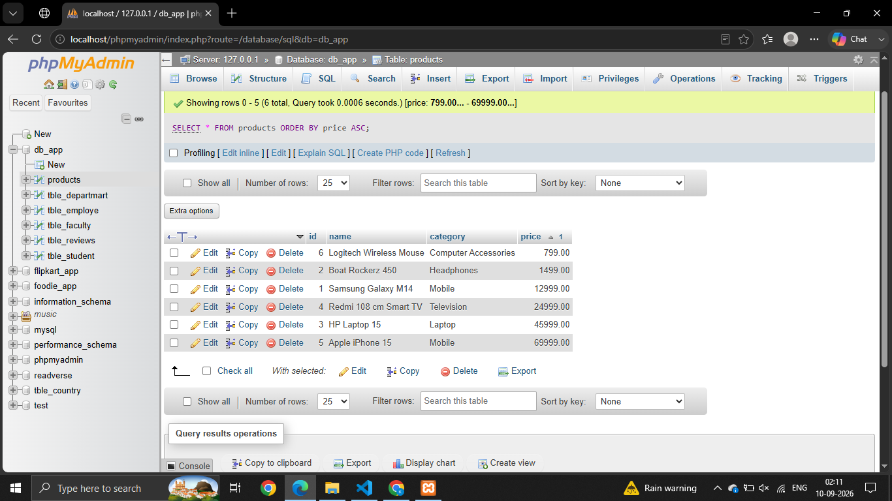
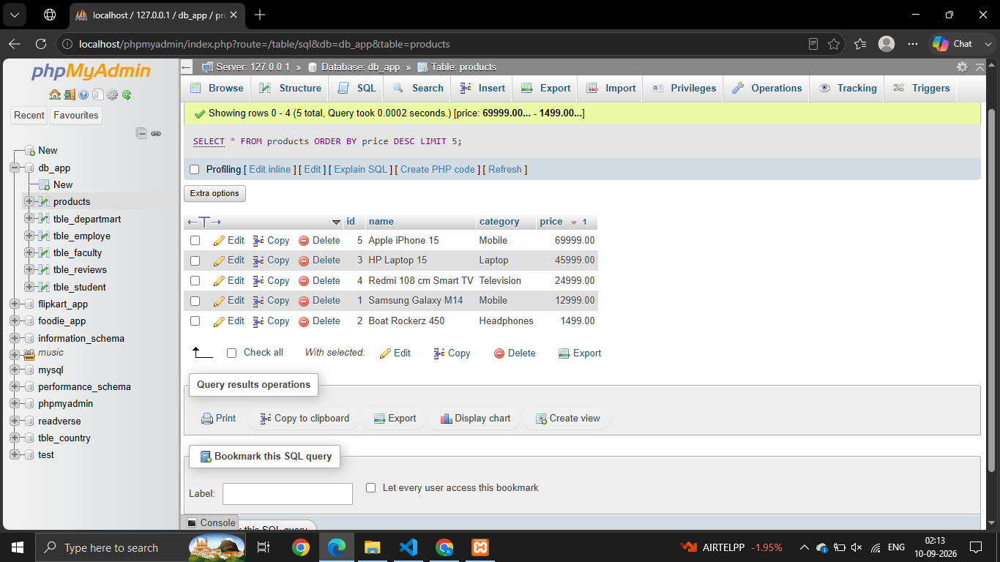
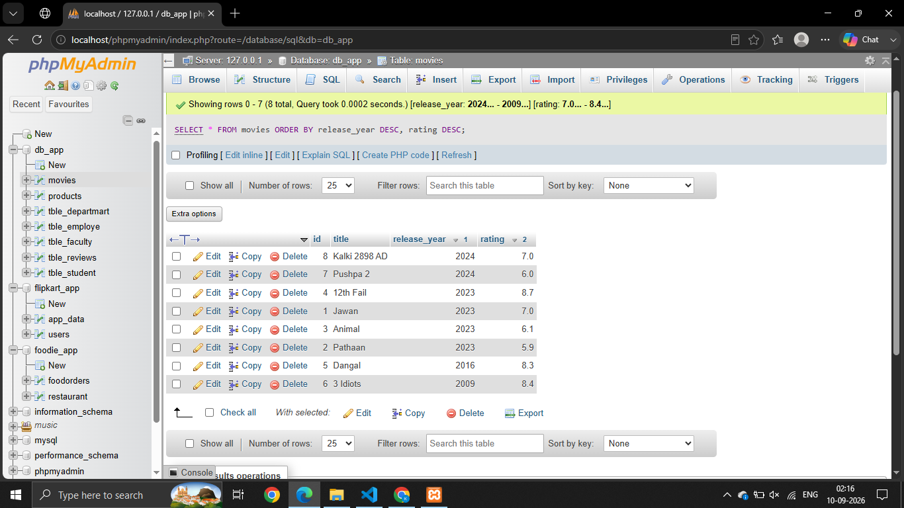
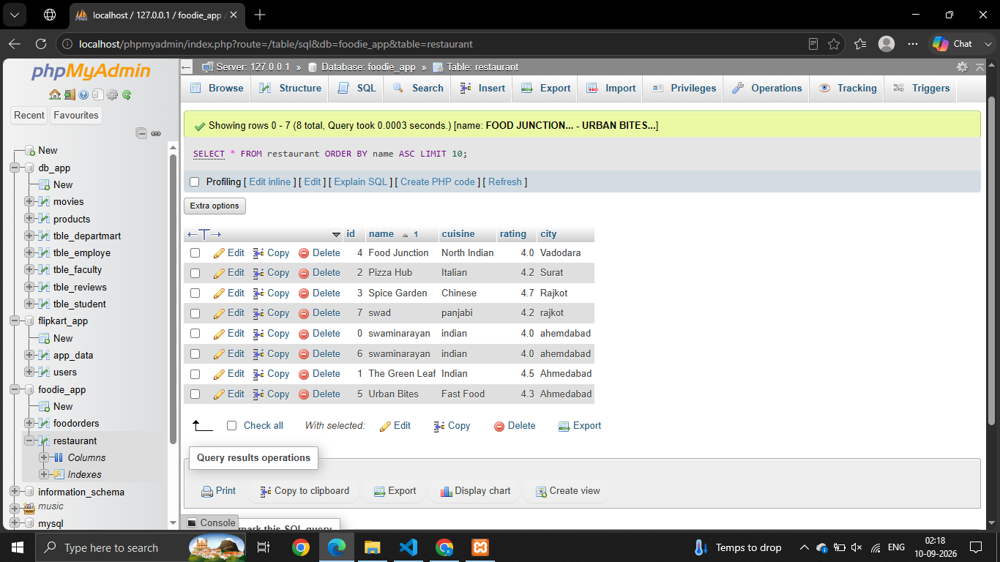
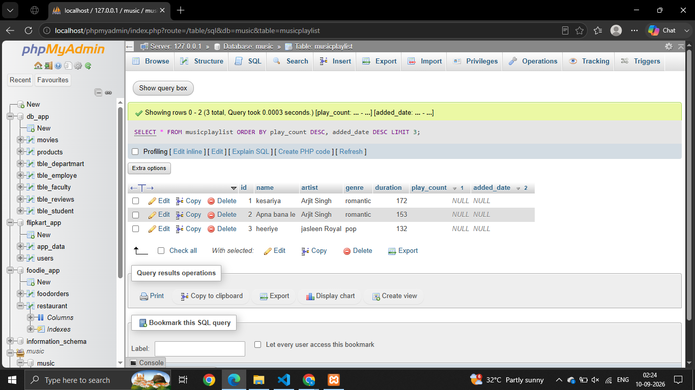

# Session - 6

# Que - 1
Write an SQL query to display all products from a 'products' table and sort them by price in ascending order, similar to how Flipkart lists items from lowest to highest price.

```
SELECT * FROM products ORDER BY price ASC;

```


# Que - 2
Modify your previous query to show the top 5 most expensive products using ORDER BY with DESC and LIMIT.

```
SELECT * FROM products ORDER BY price DESC LIMIT 5;

```


# Que - 3
Given a 'movies' table with columns 'title', 'release_year', and 'rating', write an SQL query to list all movies sorted first by release_year in descending order (latest first), then by rating in descending order (highest rated first).

```
SELECT * FROM movies ORDER BY release_year DESC, rating DESC;

```


# Que - 4
Write an SQL query to display the first 10 restaurants from a 'restaurants' table, sorted alphabetically by name, just like Zomato's A-Z listing.
```
SELECT * FROM restaurant ORDER BY name ASC LIMIT 10;

```


# Que - 5
Suppose you want to display the top 3 trending songs from a 'songs' table based on play_count, but if two songs have the same play_count, the more recently added song should come first. Write the SQL query to achieve this.
```
SELECT * FROM musicplaylist ORDER BY play_count DESC, added_date DESC LIMIT 3;

```
