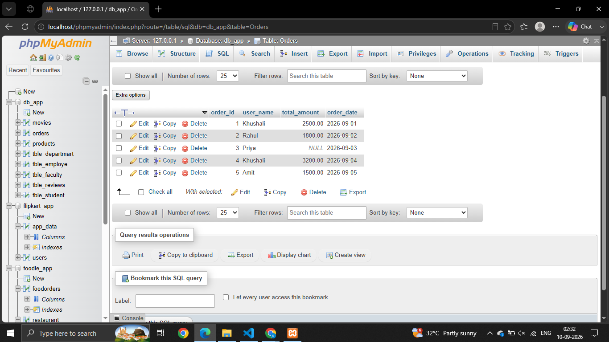
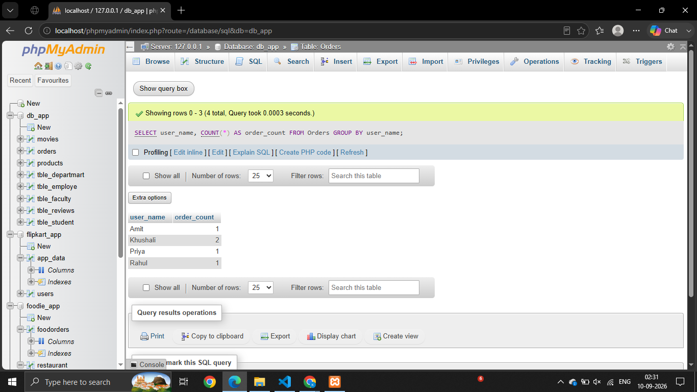
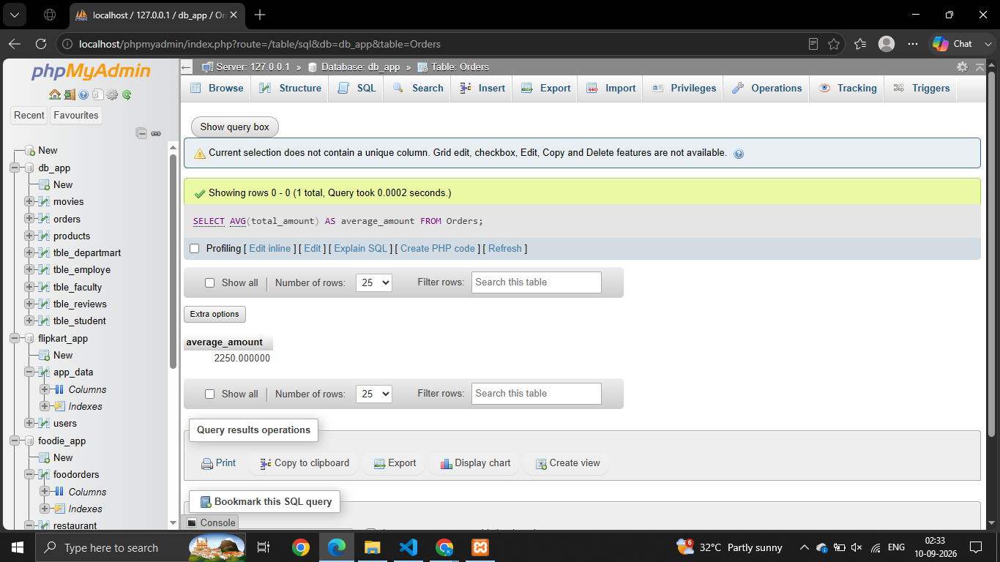
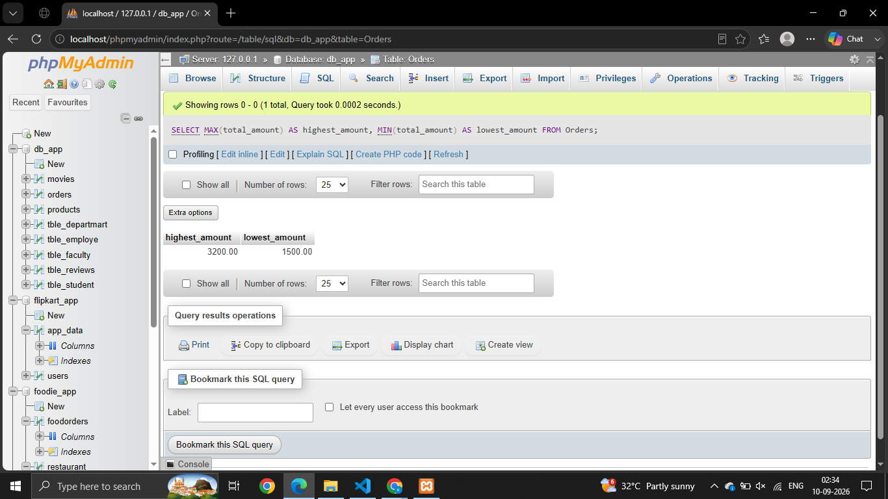
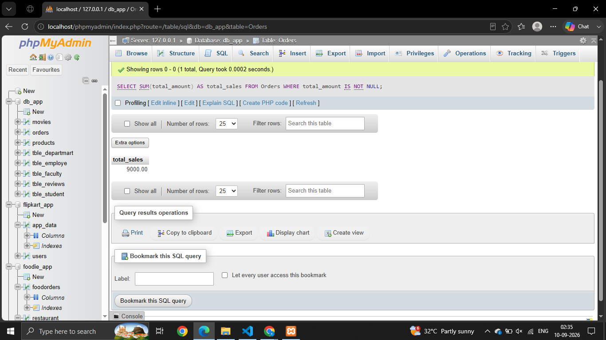

# Ssssion - 7

# Que -1 
Create a table called Orders with columns: order_id, user_name, total_amount, and order_date. Insert 5 sample rows with different users and order amounts, including at least one NULL value for total_amount.

```
SELECT * FROM Orders
```


# Que - 2
Write a SQL query to count how many orders were placed by each user in the Orders table, displaying user_name and the number of orders as order_count.

```
SELECT user_name, COUNT(*) AS order_count FROM Orders GROUP BY user_name;
```


# Que - 3
Write a SQL query to calculate the average total_amount of all orders in the Orders table, making sure to ignore any NULL values.

```
SELECT AVG(total_amount) AS average_amount FROM Orders;

```


# Que - 4
Suppose you are building a Flipkart-style dashboard: Write a SQL query to find the highest and lowest order amounts (MAX and MIN) from the Orders table, and display both values in a single result row.

```
SELECT MAX(total_amount) AS highest_amount,
MIN(total_amount) AS lowest_amount FROM Orders;

```


# Que - 5
Write a SQL query to calculate the total sales (SUM of total_amount) for all orders, but only include orders where total_amount is not NULL.

```
SELECT SUM(total_amount) AS total_sales FROM Orders WHERE total_amount IS NOT NULL;

```
