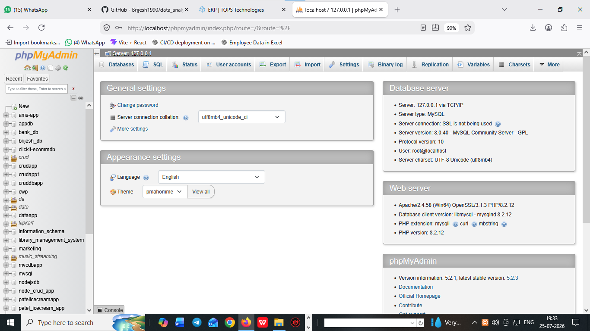

# What is  SQL and database ?


# what is SQL ?

- A SQL Stands for standerd queary language 
- A SQL is used to create a database and table structured 
- A SQL is used to create a structured data 
- A SQL is case-insenstve language 
- insenstive language example: INSERT | insert | Insert 

# What is Data ?

- A database is used to stored an information i.e called database
- List out Five types of database

 1. Oracle
 2. Mysql
 3. Sqllight
 4. Sql server
 5. MongoDB


 # how to open Xampp

 xampp=>control panel=>start

localhost/phpmyadmin




# how to open mySQLworkbench8.0

https://dev.mysql.com/downloads/workbench/
open mysqlworkbench
create an database instance


# what is difference b/w SQL and MYSQL

 # SQL 

 1. sql is an structured query language
 2. sql is case insenstive language
 3. sql is create database and tables structured

# MySQL

 1. mysql is an database 
 2. mysql is case sensitive language 
 3. sql is create database and table structured

 # What is DBMS ?
 1. DBMS stands for database management system
 2. DBMS is used to manage database

    1. Oracle
    2. Mysql
    3. Sqllight
    4. Sql server
    5. MongoDB

 # What is RDBMS?
  1. RDBMS stands for relational database management system
  2. 

# Types of SQL command

 - DDL (Data Deffination Language)
 - DML (Data Manipulation Lnguage)
 - DQL (Data Queary Lnaguage)
 - TCL (Tansactional Control Language)


 # DDL (data defination language)

 - A DDL is used to create database and table defination
 - A DDL is used to create database name and table name and its structure
 - A DDL queary are ...

 1. Create
 2. alter
 3. rename
 4. change
 5. drop
 6. truncate


## how to create database ? 

**syntax**

```
create database databasename;
or
create database db_app; 
``` 

## how to create table  ?

**table datatype and size structures**

# SQL Table Structure

| Column Name | Data Type | Size | Description |
|-------------|-----------|------|-------------|
| ID | INT | 11 | Primary Key (auto_increment) |
| FirstName | VARCHAR | 0-255 | Employee first name |
| LastName | VARCHAR | 0-255 | Employee last name |
| Email | VARCHAR | 255 | Email address |
| Phone | VARCHAR | 20 | Contact number |
| DateOfBirth | DATE | - | Birth date |
| Salary | DECIMAL | 10,2 | Employee salary |
| IsActive | BIT | 1 | Active status |
| CreatedDate | DATETIME | - | Record creation date |
| UpdatedDate | DATETIME | - | Last update date |
| address     | text     |  for more text   |
| multiple choice | enum |  for multiple choices |
| mobile | bigInt | 20 | for bigInt   |
| photo  | blob   | bigsize           |


**syntax**

```
create table tablename(
id int auto_increment primary key,
name varchar(255),
password varchar(255),
mobile bigInt,
address text,
appointmentdate_time datetime
);
or

create table users(
id int auto_increment primary key,
name varchar(255),
password varchar(255),
mobile bigInt,
address text,
appointmentdate_time datetime
);

or

create table employee(
empid int AUTO_INCREMENT primary key,
name varchar(255),
password varchar(255),
gender varchar(255),
hobby varchar(255),
address text,
phone bigint    

)
``` 

## alter

1. alter is used to add new column in a table
2. alter is used to modify or add or update new column in tables
3. alter also create a unique key in column.
4. alter tables add column | modify column | update column in tables

**syntax**

```
alter table tablename add columnname datatype(size)
or
alter table employee add country varchar(255)
or
alter table employee add state varchar(255)
or
alter table employee add photo blob after name;
or
alter table employee change phone mobile bigint;
or
alter table employee add unique(`mobile`)

```

 ## Drop

 1. drop is used to delete or drop a database or data structures
 2. drop is delete structure of database and table 
 3. after drop we never rollback

 *Syntax*
 ``
 drop database databasename
or 
drop database db_app;

drop table tablename
or
drop table employe
or
drop table users

```
 ## Truncate :

1. truncate is used to delete or remove all data from the table
2. truncate is used to empty all data from table
3. after truncate we never rollback data

*Syntax*
``
tuncate table tablename
or
truncate table employe
``

## Rename

 1. Rename is used to change any table name

 *Syntax*

 ``

## revised...

*Create a table tble_reviews with following column name *

tble_employe
rid
name
email
phone
rating
comment

## DML : Data manipulation Language 

1. DML is used to manipulate data in table 
2. DML is used to insert | delete | Update 
3. DML used for manipulating language 

* Queary used for DML *
1. Insert
2. Update
3. Delete

## How to insert 


## How to delete data 

 1. all data delete from table

 ```

 delete from tablename 
 or
 delete from tble_employe

 2. delete one row 


 6. delete data or row using limit
 ```
 delete from tbl_country where cid > 0 limit 4 ;

 ```

 ## Upadte a data or rows
 
 - update rows 

```
update tbl_employee set name='khushali',image='k.jpeg',password='k$$123',gender='female',hobby='reading,surfing',address='150 raiya road rajkot',mobile=635941323,country='uk',state='london' where empid=16

```

 ## DQL

 1. data query language
 2. DQL is used to select data or fetch data

 ## DQL Query

 1. Select

 ** Fetach data or select data **
 - Select all data from table 

 ```
 - Select particular ulter data from table 

 ```
 select * from tbl_employe where emid in (5,6,9);
 
# select particular range of data   from tables

```
select * from tbl_employee where empid between 1 and 100;

```

# select particular columns of  data  from tables

```
select empid,name,email from tbl_employee;

```

# select particular data using limit  from tables

```
select empid,name,hobby from tbl_employee where limit 3,5;
or
select * from tbl_country where cid limit 4,1;
```

# order by : 

1. order by is used to filter data in asc and desc order

```
select * from tbl_country order by cid;
or
select * from tbl_country order by cid asc;
or 
select * from tbl_country order by cid desc;

```


# group by :

1. group by is used to grouping or filters data on group of columns 

**Syntax**

select sum(salary),department as sumof_salary from tbl_employee group by department;

# alias of column name 

1. alias is nickname of column

**Syntax**

```
select count(empid) from tble_employe;

or

select 
```

# SQL Function :

- SQL provide its inbuild function

- SQL Function are:
     1. Aggrigate Function
     -sum()
     -avg()
     -count()
     -max()
     -min()

     2. Scalar Function 
     -first()
     -last()
     -lcase()
     -ucase()
     -now()
     -datetime()
     -timestamp()

# SQL Function Quearres..

** Example of Aggrigate Function**

1. Select sum(salary) as sum_of_salary from tble_employe;
2. Select avg(salary) as avg_of_Salary from tble_employe;
3. Select count(empid) as total_numbers_Salary from tble_employe;
4. Select max(salary) as highest_Salary from tble_employe;
5. Select min(salary) as minimum_Salary from tble_employe;

** Example of Scalar Function **

1. Select first(empid) from tble_employee;
2. Select last(empid) from tble_employee;
3. Select lcase(name) from tble_employee;
4. Select ucase(empid) from tble_employee;
5. Select now(added_date_time) from tble_employee;
6. Select datetime(added_date_time) from tble_employee;
7. Select timestamp(added_date_time) from tble_employee;


# subquery :  

1. subquery is used query within another query i.e called subquery

```
select max(salary) as second_highest_salary from tbl_employee where salary < (select max(salary) from tbl_employee)

or

SELECT MAX(salary) AS second_highest_salary FROM tbl_employee
WHERE salary < (SELECT MAX(salary) FROM tbl_employee WHERE salary < (SELECT MAX(salary) FROM tbl_employee where  salary < (select max(salary) from tbl_employee)));

or 


SELECT MAX(salary) AS second_highest_salary FROM tbl_employee
WHERE salary < (SELECT MAX(salary) FROM tbl_employee WHERE salary < (SELECT MAX(salary) FROM tbl_employee where  salary < (select max(salary) from tbl_employee)));

``` 

2. select * from tbl_employee order by salary desc limit 1,1;

3. select * from tbl_employee order by salary desc limit 2,1;   


# SQL like operator ? 

  1. searching the data from tables via its **words** or **wildcard**
  2. searching data from tables used like 

  ```
  select * from tbl_employee where name like 't%';
  or
  select * from tbl_employee where name like '%h';
  or
  select * from tbl_employee where name like '%a%';
  or 
  select * from tbl_employee where name like '%r' or name like '%h';
  or 
  select * from tbl_employee where name in('deep','mayur','kumar');

  ```

# SQL key constrains

1. SQL key constrains are set a limit on table 
2. SQL key constrains are 3 types in SQL 

- Primary key
- Unique key
- Foregin key

# Primary key 

1. A primary key provide unique data
2. A primary key always be auto_increment with primary key
3. A primay key one time in a table 
4. A primary key never return null value 

| id   |  name  |  age  | address |
|------|--------|-------|---------|
|  1   |  abc   |   11  | rjt     |
|  2   |  def   |   12  | rjt     |
|  3   |  xyz   |   13  | rjt     |


```
create table tble_departmart(
   d_id int auto_increment primary key,
   d_name varchar varchar(100)
)

# Unique Key

1. A Unique key provide unique data
2. A Unique key never return a duplicate data
3. A Unique key provide more than one column in a table 
4. A Unique key return one time a null value 

| id   |  name  |  age  | address |  Phone     |
|------|--------|-------|---------|------------|
|  1   |  abc   |   11  | rjt     | 9954321766 |
|  2   |  def   |   12  | rjt     | 9954321767 |
|  3   |  xyz   |   13  | rjt     | 9954321768 |

```
craete table tble_user(
    u_id auto_increment primary key,
    u_name varchar(200),
    u_age int,
    u_address text,
    u_phone bigint

)

```
```
alter table tble_user add UNIQUE('u_Phone')

```

# Foregin key

1. A fk is provides for relationship b/w tables
2. A fk  return a dublicate data
3. A fk provides more than one columns in a tables 
4. A fk provides for relationship b/w tables with common field 

**tbl_students**

|     id      |   s_name  |   l_name | address  |  phno      |
|-------------|-----------|----------|----------|------------|--------|
|    1        |   bhavesh |    27    |  rjt     | 915455444  |   
|    2        |   Jay     |    22    |  ahmd    | 912121212  | 1       |


**tbl_faculty**

|   f_id(pk)  |    f_name |   l_name |  address | 
|-------------|-----------|----------|----------|               
|    1        |   Brijesh |    27    |  rjt     |
|    2        |   Mitesh  |    22    |  ahmd    |           


**create fk via sql**

```
create table tble_student(
    s_id int AUTO_INCREMENT PRIMARY KEY,
    s_name varchar(255),
    s_age int,
    mobile bigint,
    address text,
    f_id int AUTO_INCREMENT PRIMARY KEY,
    FOREIGN KEY(f_id) REFERENCES tble_faculty(f_id)
    );

```


